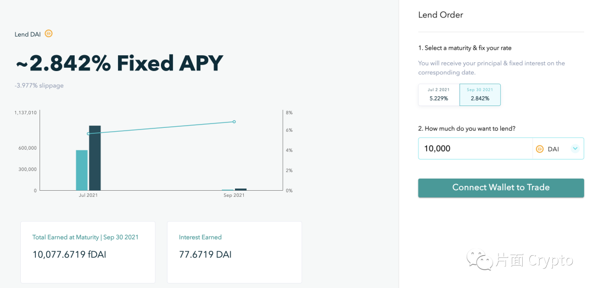
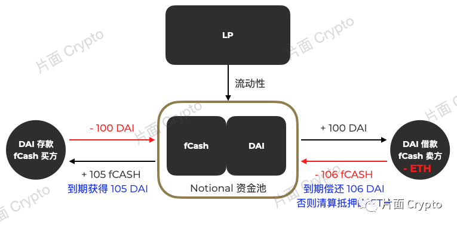
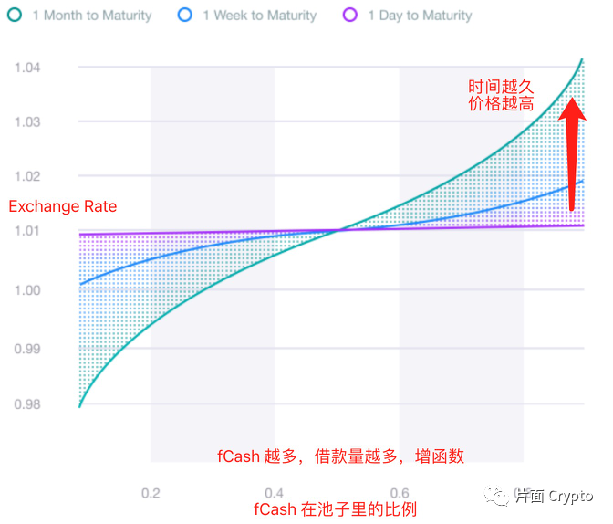
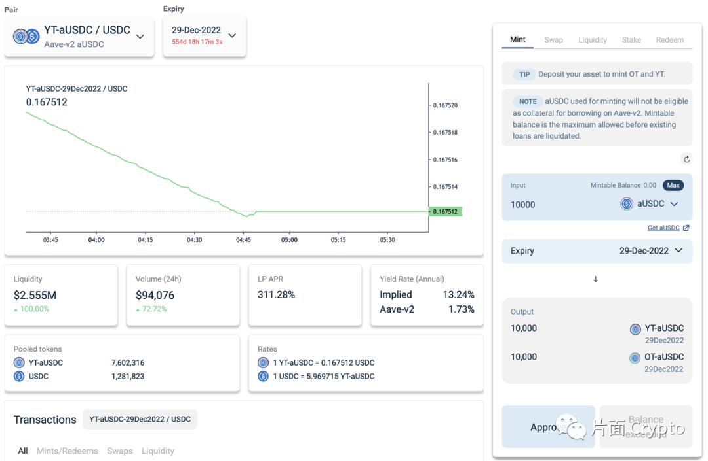
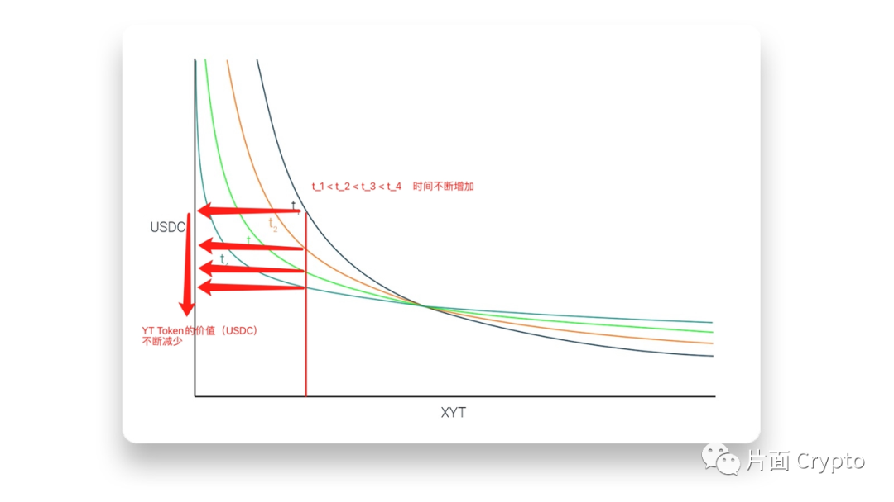
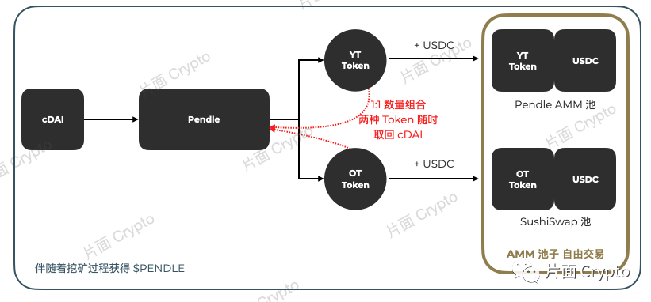
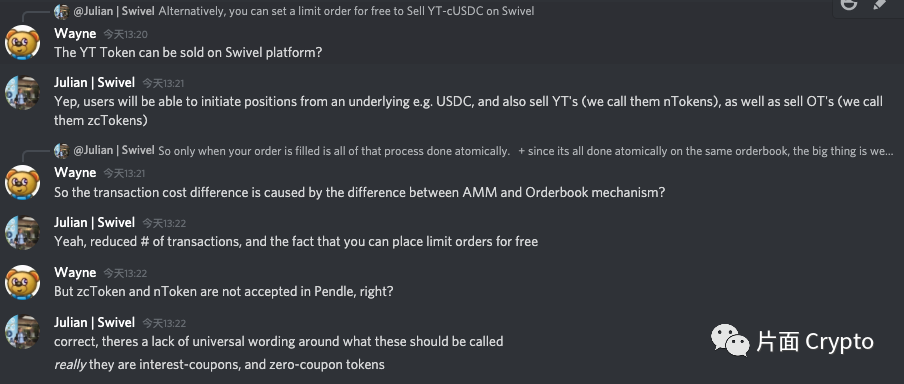
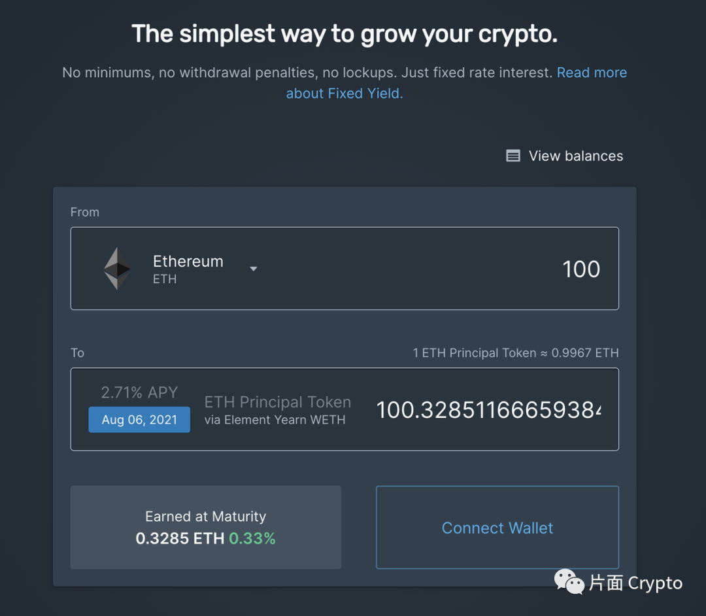
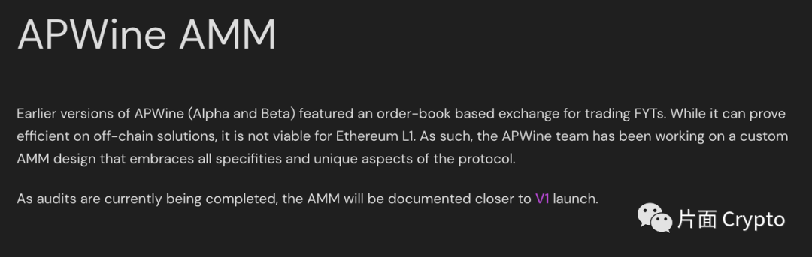

> 为了更好理解这些项目，我们想象一个非常常见的场景：有一个 DeFi 用户叫做阿彪（我大学室友的名字，actually）钱包里面有 10,000 DAI 希望用于理财。

> 他最直接的一个选项便是：把 10,000 DAI 存入 Compound 或者 AAVE 然后吃浮动的利息（还有挖矿奖励）。

> 记住，阿彪把 10,000 DAI 存到 Compound 或者 AAVE 之后会获得 cDAI 或者 aDAI。这个获得的 cDAI 或者 aDAI 就是存款凭证，也是 Interest Bearing Token --- 能获得利息。

<!-- truncate -->

固定利率借贷，以及利率衍生品（零息债券，Yield Generating Token）类别的项目逐渐增多，并且陆陆续续也已经上线。这些项目理解起来的难度相对于普通的借贷和 AMM 相对更加复杂。

本片只是在目前这些项目公开资料的阅读，已经上线的产品（主网或者测试网）的体验，以及与项目的团队访谈沟通的基础上整理。希望能够帮助大家更好的理解这些项目。由于本人能力的限制，在文字中很可能出现理解有错/偏差，或者是专业词语用词不准确的地方，还希望读者谅解。对于这些项目有兴趣的读者欢迎联系。

这个赛道的项目后续还会更新，未来也一定有新的项目出现。本文一共涉及到了 Notional，Pendle，Swivel，Element，APWine 五个项目。但是实际上 88mph，Yield 等也都属于这个类别，后面这些项目很久之前看过，最近的更新不知道是什么情况没有来得及看。其实总体上也是大同小异，这个赛道的爆发可能还需要一段时间，并且很可能出现像 AMM 一样的赛道的情况，但是由于门槛较高可能数量不会那么多，但是还是很可能出现百花齐放的情况。

开头最后再说一句，最近市场非常不好，但是看到这些相对优质的项目实际上都在做一些事情，而且不是短期的事情。市场的情绪必然会影响我们做出非常多不理智的判断，但是不管是在这个行业还是其他行业，认定一件对的事情坚持下来总没错。

Time will tell. Let's BUIDL.

## Notional

Notional 是一个提供固定利率借贷的协议，解决了现在的借贷协议普遍存在的利率高波动问题（收益不稳定），属于零息债券（Zero-Coupon Bond）。

目前 Notional 提供三个功能（产品），分别是：

根据一个固定利率借钱；

根据一个固定利率贷钱出去；

根据一个浮动利率提供流动性获取收益；

1. 固定利率借款需要提供以太坊作为抵押物，具体的抵押率可以自由调节，最小为 140%。在借款的过程中同时需要明确借款的金额以及时间范围，时间越长/金额越大，利率越高。但是一旦这两个参数确定，借款的利率也得到确定。在确定了参数后，单笔交易同时将用户的 ETH 抵押物抵押到 Notional 的合约中，将借出的 USDC 发送到用户的钱包地址。

2. 贷钱出去和借款的操作类似。

3. 提供流动性赚取的则是 Notional 资金池里的交易费用。

Notional Finance 协议的核心在于其 AMM 和 fCash（凭证）。借款用户、存款用户和流动性提供者都在 AMM 资金池内通过 fCash 联系起来。

存款用户在 AMM 池子里存入 DAI，获得 fCASH。同时这个行为也可以理解为使用 DAI 购买 fCASH。

借款用户在 AMM 池子里面取走 DAI，获得 “负的 fCash”。同时这个行为也可以理解为卖出 fCash，买入 DAI。

而流动性提供者则是同时提供这两种资产，为存款用户（fCash 的买方）和借款用户（fCash 的卖方）提供流动性。

三方在交易的 fCash 实际上就是 DAI 的时间价值。借存款的利息实际上就是 fCash 的价格。由于是 AMM 模型，借存款的过程必然也会出现滑点的情况，而滑点实际上就是交易导致的 fCash 在短时间内价格的变化（从而导致的长期的借存的成本或收益）。

Notional Finance 采用的 AMM 价格模型必须满足直觉上的两个要求：

- 池子里数量不变的情况下，fCash 到期时间越长，价格越高（相同金额，明年到期的债要比明天到期的债利息收入高）；

- notio到期时间一定的情况下，借款的人越多，利率越高 --- 供需决定。

现在明确了 fCash 的价格其实就是利率。

从动态效果来看，随着时间的推移，Notional 的 AMM 函数围绕着中心点顺时针旋转（fCash 的时间价值减少）；而下面说的 Pendle 则是均衡点从右到左移动（YT Token 的时间价值减少）。

总结来说，Notional 利用围绕着 fCash 构建的 AMM 池，把 fCash 的价格和借存款的利息联系起来。同时采用动态的 AMM 函数把时间维度加入，实现了在池子中买卖 fCash 进行存款借款活动的功能。而买卖的价格决定了买卖获得的 fCash（正数或者负数）的数量，在 fCash 到期后兑换或者偿还确定数量的稳定币，从而实现了借存款的固定利率功能。

<blockquote>
22 号早上八点半跟 Notional 的创始人 Teddy 电话沟通聊了聊情况，问了几个关于项目的问题，摘选几个关键的。

Q1: Notional V2 的新功能主要包含哪些？

1. 增加时间更长的借存款产品（目前最长只有到九月三十，一个季度左右的长度）；

2. 抵押物的种类增加（目前只有 ETH）；

3. 提供流动性的方式改变，增加 nToken 代表全部池子的流动性（目前不同的流动性池子分开，用户提供流动性需要自行选择不同的池子）；

4. 和 Compound 合作，直接接受 cToken 作为流动性提供；

Q2: 面临的最大问题是什么？

1. Layer2 的规划和开发上线；

2. 提供时间长达 10-20 年之久的产品（有规划有想法，进行中）；

Q3: 会不会想要抢占 Compound/AAVE 的市场份额？

不会，Notional 提供的产品是独特的。和 Compound 更多的是合作的关系；虽然可能会抢占部分 Compound 的用户，但是更多的是自己的产品的目标用户。

Q4: 会不会担心 Compound/AAVE 也推出固定利率的产品，又或者 Notional 提供浮动利率的产品（和 Compound/AAVE 一样）？

不会。如果 Compound 也想做固定利率的产品，那么一定是跟 Notional 合作来进行。Notional 无意抢占目前的市场，如果未来有精力更多的是开发以 Notional 本身为主的产品，项目有自己的方向。

Q5: 最大的竞品？

Yearn。（原话有些 Aggressive，就不放了，总之就是对自己的产品非常自信）。

目前团队7-8个全职，关于 Token 的消息 Teddy 不希望 Make it public，所以这里就不把 Token 的相关内容放进来了。

</blockquote>

## Pendle

Pendle 是一个利率衍生品协议。Pendle 允许用户把 Interest Bearing Token（存款凭证）存入 Pendle 进行拆分，变成本金凭证（OT Token）和利息凭证（YT Token）。

Pendle 提供了把未来现金流（利息）单独拆分开来的然后进行交易的功能，可以理解为是一种利率的衍生品。

- 本金凭证允许用户到了到期日获取同样数量的本金；

- 利息凭证可以用于交易，或者随时与本金凭证一起赎回本金。

> 阿彪把 10,000 DAI 存到 Compound 后获得了 46.6 万枚 cDAI（一枚 cDAI 的价格约为 $0.021）。随后阿彪觉得 Compound 的利息太低且浮动，心里没底，就选择把这 46.6 万枚 cDAI 存到了 Pendle 里并且选择了2022年12月29日到期，并且获得了 46.6 万枚 YT Token 和 46.6 万枚 OT Token。阿彪获得的这两种 Token 明确的作用为：

> · 46.6 万枚 OT Token：OT Compound DAI 29DEC2022 允许阿彪在 2022年12月29日赎回价值约一万美元的本金，当然，阿彪也可以在任意时间折价卖掉他们（在 SushiSwap）。

> · 46.6 万枚 YT Token：YT Compound DAI 29DEC2022 允许阿彪获得原来的 Compound 分发的收益，并且阿彪可以把这些利息凭证直接卖掉，直接把到2022年12月29日的未来现金流折现。

> · 所以阿彪如果就是为了定期存款，那么他可以直接把 46.6 万枚 YT Token 直接卖掉，按照现在价格获得约 1,560 USDC，然后等待 OT Token 到期，把本金取回来。

OT Token 并没有过多操作可以进行，现在 Pendle 支持把 OT Token 和 USDC 放入 SushiSwap 组合流动性，然后获取挖矿奖励。OT Token 的价值随时间不断增加，也就是折价逐渐减少（越来越接近赎回世界代表的本金）。

YT Token，也就是未来利息收入的 Token 相对来说就灵活许多。YT Token 的时间价值逐渐减少（越到到期时利息越来越少）。但是短期内如果用户觉得市场的利率会增加，那么就可以直接用 USDC 购买 YT Token，直接接受利率的风险敞口，然后等到利率上涨时卖掉。

YT Token 的交易场所在 Pendle 内进行，Pendle 设计了 AMM 协议，相对于 Uniswap 的简单模型增加了时间的属性，也就是 YT Token 随时间增加价值减少的特性。这样的设计主要为了解决流动性提供者面临的无常损失问题。

当然，用户在用 cDAI 兑换了 YT 和 OT Token 之后，可以在任意时间通过提供 1:1 组合的 YT 和 OT Token 随时赎回对应数量的 cDAI。

简单来讲，Pendle 通过把 Interest Bearing Token 拆分成本金和利息凭证两种 Token，并且允许这两种 Token 自由交易，提供了用户 “Play with” 利率的可能性。通过对未来利率的判断来接受全部的利率风险敞口，或者为用户提供提前锁定的理财收入。

关于 Pendle AMM 随时间增加，均衡点移动可以简单理解为，如果没有任何交易发生，如果采用类似于 Uniswap 的函数，那么流动性提供者从开始到退出获得的 USDC 和 YT Token 数量都是一样的，但是上面说了 YT Token 的价值是随时间减少的，所以 LP 会受到损失。采用一个反向作用的 AMM 函数，伴随着交易的进行，LP 在退出时，等量的 LP 份额会获得更多的 USDC 和更少的 YT Token，从而解决做市带来的损失。

## Swivel

Swivel 和 Pendle 类似，也是一个提供利率衍生品的协议，此外还能提供固定利率存款。在 Pendle 的基础上了解 Swivel 可能更加方便。

Pendle，用户把 Interest Bearing Token（cDAI）拆分成一个本金（Ownership Token/Principal Token，也就是零息债券。这个零息债券随着时间的增长增值，最终折价消失能够兑换回本金。另一个是利息凭证（Yield Bear Token，YT Token），利息凭证随着时间推移，价值降低逐渐归零。此外利息凭证还能够获得本金存款的利息。

拆分完之后，用户自行在特殊的 AMM 中交易，AMM 需要考虑的就是上述的特征（均衡点随时间变化）。

相比之下，Swivel 有几点不同：

- 使用 Orderbook 而不是 AMM，也就不需要考虑复杂的 AMM 机制设计问题；

- 没有抵押品，用户直接在二级市场选择订单然后进行交易 --- 提高资本使用效率；

Swivel 和 Pendle 一样，也是把 Interest Bear Token 拆分成两个一个本金凭证，一个利息凭证（在 Swivel 里分别叫做 zcToken 和 nToken）。zcToken 就是零息债券，和 Pendle 里面的 OT Token 一样，随着时间增值，交易时有折价。nToken 有利息，自由交易。

除了铸造两个 Token 的规则不同， AMM 和 Orderbook 的不同（影响资金效率，Swivel 更加自由一些，市场上的交易完全由交易双方发起，价格也是由交易双方决定），利率凭证在两个协议内都可以追踪其持有期间的实际背后存款带来的收益。此外，YT Token（Pendle 的叫法）相比于 nToken（Swivel 的叫法），转账的成本稍高，因为涉及到的计算量更大一些。交易成本的不同其实也是由于 AMM 和 Orderbook 的不同造成的。

除此之外，Pendle 的 OT 和 YT Token 能够在 Swivel 平台进行交易，当然是采用 Orderbook 的模式，但是反之不能，也就是 Pendle 并不能接受 Swivel 的 zcToken 和 nToken。

## Element

Element 和 Pendle 还有 Swivel 都类似，详细内容就不多说。简单来讲也是把 Interest Bear Token 拆分成两个。Element 为本金凭证（在 Element 里被叫做 Principal Token）的交易设计了一个随时间增值的 AMM（相比之下，本金凭证在 Pendle 里是在 SushiSwap 中交易，没有任何特殊的地方，没有考虑随时间的增值；而在 Swivel 中则是完全自由的 Orderbook 模式）。

因为 Principal Token 在 Mint 的过程中数量会增加：10% 的利率，10 个 ETH 在 Element 中铸造成为 11 个 Principal Token，也就是在一年后直接一比一堆换成 11 个 ETH。因而需要一个考虑时间价值的均衡点移动 AMM。

## APWine

APWine 也是同样类型的项目，Interest Bearing Token 拆分。但是具体的信息 APWine 还没有披露，根据官方的 Doc 只能看到之前的设计是采用 Orderbook 的模式，而现在的 V1 则是采用 AMM 的形式。如果是这样，那么 V1 将会和 Pendle 非常相似。

## 写在最后

这篇其实想写很久，因为很多事情耽搁了。在写的过程中也有很多事情打断，可能导致整体读起来并不会那么流畅。由于本着做做简单研究的目的，就不再重新整理总结再修改了。欢迎看到这篇的老师前辈们指点。

熊市嘛，学习，学无止境。

