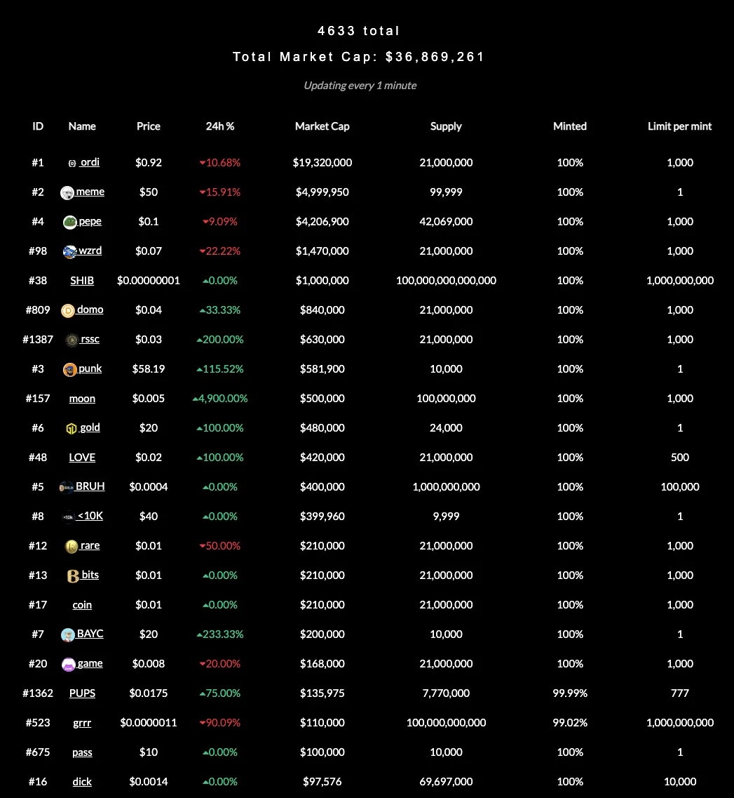

我们讲一个小故事。

你喜欢的明星发了明星的纪念卡，明星的粉丝都愿意去买这个纪念卡，纪念卡的数量有限，每年发一定数量，不是一次性发完卖完，而且每个卡都有出厂日期。每个纪念卡都镶上了两克白银，并且纪念卡上还能写字。

以上这个背景应该都能看懂吧？

这样的话，我们就能够总结一些关于纪念卡基础的属性：

- 总量有限，但是流通的数量是逐渐增加的；

- 纪念卡有基础价值，即使明星黄了也能够把卡上镶的两克白银拿出来给卖了；

- 卡上能写字，明星留言了之后会让卡变得珍贵更值钱。

一开始的时候市场上都在炒作这个明星卡，甚至给明星卡赋能说有卡能换跟偶像见面吃饭的机会，能换演唱会的门票，而且不限次数。

这个卡的价格就被越抄越高。（当然，我们假设明星不会糊）

<!-- truncate -->


后来有一天，有人发现了这个卡能写字加上出厂日期两个特点能够发挥出更大的价值，或者说有更大的炒作空间。比如说：

- 每年明星生日那天的卡，在卡上写上 “*** 生日快乐”，就更有人想要

- 每年的第一天生产出来的卡可以写 “一年之际在于春”（当然，这个肯定是粉丝写，因为好多 Idol 可能并不知道这句话）

- 每十年的第一张卡写上

<center>
```
哥哥貌潘安，
妹妹心心念。
相伴第十年，
爱你永不变。
```
</center>

这张卡就会更值钱。

上面的故事看懂了吗？看懂了我们就把这个故事用比特币的情况再说一遍。

没看懂的赶紧找个爱豆去爱上 TA。

比特币的总量是有限的，2100 万个

- 比特币可以细分，1 个比特币 = 1 亿个 Satoshi（大概发音：撒偷袭），10 的 8 次方

- 每一个 Satoshi 上面现在都可以写字了！（实际上是附上任意格式的信息，当然不能太大，你想在 Satoshi 上附上一个葫芦娃全集还是不太可能的）

- 把一个 Satoshi 上面写上字（附上信息），那每一个 Satoshi 就可以是独一无二的了！

独一无二 + 区块链 = NFT 啊！

所以你现在知道比特币 NFT 到底是什么了吗？

比特币 NFT 就是在比特币的最小单位 Satoshi 上附上你想加的信息，就完事了！

当然这个能够实现是基于比特币的 Taproot 升级之上，太技术了有兴趣的自己去看，不看也不影响你亏钱。

---

## 比特币 NFT 和 以太坊 NFT
比特币的 NFT 和 以太坊的 NFT 区别还是挺大的，甚至可以说完全不一样。以太坊的 NFT 好比是你自己画的画，写的字，独一无二并且这个作品本身就是 NFT 本身。

但是比特币的 NFT 是被附加上去的，你可以理解为一本有作者给你写了一个专属于你的寄语的书。没有这个寄语，那本书和其他的同名书是一样的，但是加了寄语才让他变得独一无二。当然，附加上去的文字，图片等数据也是存在链上的。

所以在总结一下，以太坊的 NFT 本身就是作品本身，而比特币的 NFT 是在币（Satoshi）上添加附加物变成的。

所以，以太坊的 NFT 可以归零，完全归零没人要。但是比特币的 NFT 永远不会归零，因为无论附加物的价值如何，一个 Satoshi 始终是 1 亿分之一个比特币，实在不行还能当作比特币网络的 Gas 费用。

你现在起码能理解比特币的 NFT 是个什么概念了吗？
 
你有没有想过一个问题，就是如果你某一个 Satoshi 上附加了信息，别人也在其他的 Satoshi 上也附加额外的信息，这 tm 两个不就是一样的了吗！

非常好的问题！

是的，就是这样。

但是也可以不是这样。

我们先说怎么解决这样的问题，对于比特币网络来说，每一个 Satoshi 都是一样的，所以不同的 Satoshi 之前没有区别，但是我们可以人为让他们有区别。

我们可以人为让他们产生阶级，产生距离，产生差距，然后不一样之后他们就会陷入内部的追求/斗争/争吵/战斗之中而无暇顾及其他的事情…

总之就是给比特币的 Satoshi 编号！编号之后就会让每个 Satoshi 不一样了，就好像纸币上也会有编号一样，花是一样花，但是实际上每个纸币有不一样。

而给 Satoshi 编号的方法就是 Ordinal 理论，你简单的理解方式就是根据顺序，或者那个 Satoshi 第一次出现的时间。（前提你需要知道每一个比特币，每一个 Satoshi 最开始出现都是被从挖矿奖励里出来的）。

你甚至可以理解为每一个 Satoshi 的生日！

## 哪些 Satoshi 是稀有的？
- 最稀有的：历史上第一个 Satoshi，也就是第一枚被挖出来的比特币的第一个 Satoshi

- 每次四年减半之后的第一个 Satoshi

- 每个区块里面的第一个 Satoshi

- 等等等等

反正说这个的意思就是你要知道虽然 2100 万个比特币总量 乘以 10 的八次方 个 Satoshi 就都有了自己独特的编号。

至于具体稀有度的规则以及对应的数量，你知道有这么个玩意就行，有兴趣自己去看。

这样在理论上就解决了被复制的问题。

---

那总不能就让大家全部都乱写内容，乱发 NFT 也没个规则吧？

你又提出了一个好问题！

以太坊刚开始出来的时候，也是没有什么规范，大家也不知道到底怎么搞币。后来有人搞了一个 ERC20 标准，后面所有人都按照这个标准发币了。

同样的道理也用在了比特币的链上，推特用户 domo 就写了一个 brc 20 的标准，并且后面的人也开始用这个标准往 Satoshi 上附加信息。

https://twitter.com/domodata/status/1633658974686855168

然后这个标准其实是用来发同质化通证的，也就是发正常的币，就像 UNI，SHIB。比如说第一个这种币就叫做 ORDI。

也就是说，在每一个 Satoshi 上附加信息，让比特币产生了 NFT 的特点。而由于附加的信息都是任意的，有人就定了一个标准，大家都按照这个规范来，这样就又把 NFT 变成了 FT（Fungible Token）。

这样讲明白了吗？这样就变成了：

2100 百万 乘以 10 的 8 次方个 Satoshi

有的 Satoshi 本身由于命好，比如出现在减半后的第一个，本身就具有特殊性

有的被附上了图片/各种各样的信息变成了 NFT

有的被用同一个规则 BRC20 附上了信息，变成了大家理解的可以炒的普通的币

明白了吗？

---

所以 BRC20 是一个协议标准，可以根据这个协议在比特币网络上发币。发币也只需要设置简单的参数就能做了。

你发了这个币一开始怎么给别人呢？总不能全部在自己口袋吧？也需要别人也能 Mint。很简单，你设置一个 Mint 的规则，任何人都能来 Mint 这个币，然后人人都能获得。所以基本上所有的 BRC20 的币一开始都是免费获取的，当然你要负手续费。

https://unisat.io/

这个网站就是这么一个平台，从发币到 mint 到用 Satoshi 发 NFT 都做好了用户界面。当然， 它自己也是一个钱包。

## 那现在是一个什么状态？

我也不给你放截图说有多少个 Satoshi 被糟蹋了，总之你记住，很多，非常多。

第一个 BRC 20 的币，ORDI 总量 2100 万个，现在单价已经超过了 1 美元（截图的时候跌下来了，之前是 1 美元，很久之前一直是零点几），其他的币价格和市值在这个网站都能看到。

https://brc-20.io/



现在一共四千多种币已经被 Mint 了，那个 Minted 的百分比就是说这些币现在还能不能去 Mint，如果是 100% 说明就不行了。

你能看到，全 tm 的是 MEME。

有几个地方需要注意的

- Satoshi 是比特币的最小单位，然后 BRC20 的币对应的都是一个一个的 Satoshi，所以就不能在继续分割了，也就意味着所有 BRC20 的币都只是整数，没有 2.3 个这种情况。

- 既然所有的币/NFT 本质上都是挂在 Satoshi 上的，也就意味着这些在比特币网络中还是正常和其他一样的 Satoshi，也就是还是能够被当作 Gas，或者在你给别人打钱的时候被送走。

- 所以你一般需要把你的这些币或者 NFT 单独储存放在一个支持这些玩意的钱包。普通/原始的比特币钱包是不能识别出这些东西的。

好了，比特币 NFT，ordinal，brc20， ORDI 这些概念基本上就是这么个情况。我们在非常简单的回顾一下，结合一开始的那个故事。

### 比特币 NFT

就是在比特币的最小单位 Satoshi 上附上任意数据，让每一个 Satoshi 都带有额外信息加上在区块链上就成了比特币的 NFT。

它跟以太坊的 NFT 不一样，以太坊 NFT 就是资产/数据本身，不需要依赖于其他的币。

就是明星卡片上可以写上任意的信息，卡片也就变得多样化也能变成 NFT

### ordinal 理论

ordinal 理论是给比特币网络中的每一个 Satoshi 都编上号的方式，这样就能够让不同的人或者协议区分原来都是一样的 satoshi，为什么要这么做？因为比特币网络只能这么干

根据卡片的生产日期给每一个卡片编号

### brc20

既然可以附上任何信息，那我们就搞一个规范吧！这样就能发币了！brc 20 就是这个样的一个规范，名字模仿的是 erc20

一群狂热粉丝发起的活动“我们不能在哥哥的纪念卡上乱涂乱画，必须要按照规则：七个爱心开始，中间 15 个字，结尾427个爱心结束”

说实话这个 brc 20 真的挺 tmd 挺扯淡的，人家都好不容易搞了 nft，你又把这个 n 给去掉了

### ORDI

brc 20 协议提出者，用这个协议发的第一个币，总量 2100 万个。

第一批狂热粉丝按照上面那个规则写的第一批纪念卡

## 最后
基本就是这么个情况，那有什么机会呢？

- 现在还没有交易所支持 brc 20 的现货交易，考虑一下？一炮打响

- 其他的基础设施当然也是比较缺的

- 有其他作用的 brc20 币目前没看到，只有 meme

- 去找人家发的币，然后去 mint

- 自己去发一个币

- ......


### 那最终极的问题，这玩意有价值吗？能投资吗？
我不知道。

有的人觉得，这么搞浪费了比特币的网络存储空间，本来比特币区块大小就小，现在这么搞额外存其他的信息，这不是让本来就不富裕的家庭雪上加霜吗？

虽然支持这个玩意的比特币的技术和升级协议在做的本意都不是为了这个事情，但是奈何比特币是去中心化的是大家的是真正属于人民群众的！所以那既然这样，人民群众做什么是不是就应该欢迎什么让大家自由去做？

能投资吗？

我个人感觉玩玩肯定是没啥问题的，主要是这玩意一开始弄的话，除了时间和学习成本高一点，真正花钱也花不了太多，几十块几百块就能参与玩玩了，所以如果你爱折腾就去试试。

但是你必须要清楚，这玩意的风险很高很高，全是 MEME。
