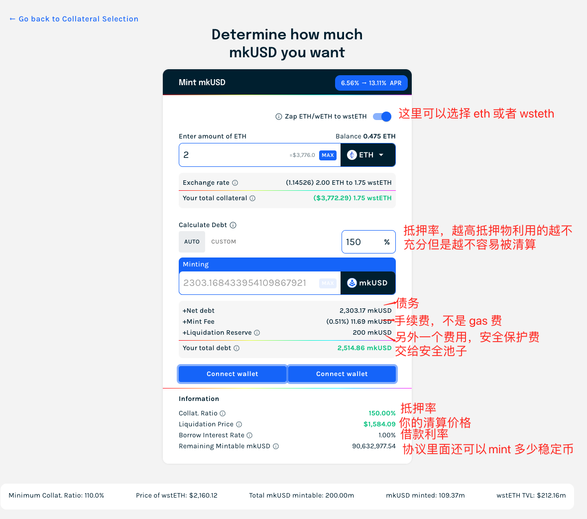
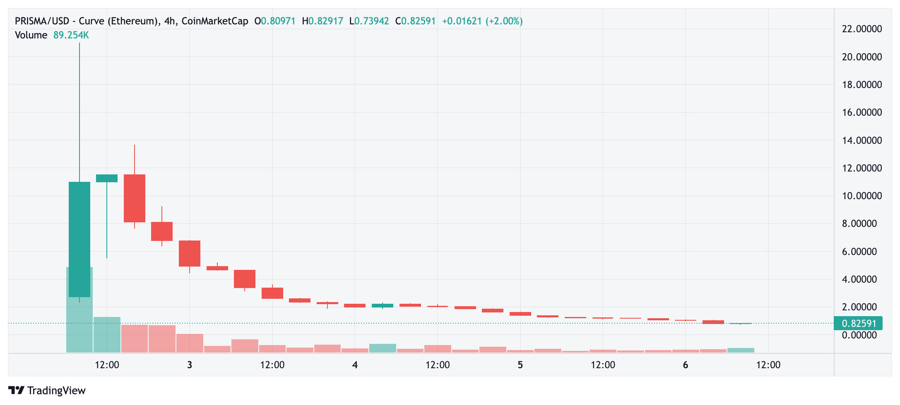

## Crypto 里面的借贷协议

借贷协议是 DeFi 里面最基础和最好理解的协议。协议提供一个或者多个池子，指定支持的 Token，存币的人赚利息，借币的人抵押获得流动性。

只不过对于不同的借贷协议来说，各个环节的设计可能不同。比如支持的币种类别不同，质押率不同，池子与池子之间的风险关联不同，清算的逻辑不同等等。

当然除了这些小的设计上的差别，还有一些做的是准许型的借贷协议，比如做 Crypto 吸储然后在现实世界放贷的 Goldfinch。名头很大，A 轮 a16z 就领投共融资 2500 万美元。只不过很可惜到目前为止新闻有报道出来的就有两笔不良贷款，一个是贷给肯尼亚的摩托车公司 500 万美元，还有一笔是贷给房地产科技公司 Stratos 700 万美元。

还有一类区别比较大的借贷协议，是无需许可的借贷协议，这里特别是指支持的 Token 不需要需要，理论上可以支持所有币的借贷。比如支持资产分级的 Euler Finance，就满足了长尾资产的借贷需求。这里具体是说，比如你发了一个币，叫做 YGB （一个币），然后你如果希望 YGB 能够在 AAVE 或者 COMP 上借贷使用，你也能抵押你的 YGB 借出来 USDT，那么你需要 AAVE 或者 COMP 社区投票通过之后才可以，但是在 Euler 上就不需要。当然，到了实际操作层面，Euler 对资产做了分级，同时抵押率也会比较高。但是不幸的是，这个项目在今年三月份被盗了。

<!-- truncate -->

综合来看，我们能发现，Crypto 的借贷协议的基本逻辑都非常类似，只不过有的是用了一个池子（抵押 A 能借 B，C，D，E 等），有的用了单独的池子，A-B 池只能抵押一个借另外一个。而最重要的利息目前基本都是基于池子的使用情况整体计算，池子的所有参与人共同平摊利息或者成本。

## Prisma

其实 Prisma 和其他的借贷协议本质上也并没有什么区别。只是它是基于 LST 的项目，LST 就是 steth，reth，cbeth 等这些币。

每当一个大类的资产崛起，或者概念崛起的时候，Crypto 都会新兴出一系列基于这些资产/概念的项目，最典型比如一条公链的崛起必然会带来公链上的项目，交易借贷等的崛起。公链比较好理解，而资产类别（当然这里是说 Crypto 的赛道，谈不上资产类别，这里为了方便就这么说了）的崛起也是类似，比如之前 ARB 上的 GMX，GMX 火起来之后，GLP 的量大量增加，GLP 本质上是 BTC/ETH/LINK 还有一些稳定币等的综合一篮子资产，这些资产又可以被二次利用，所以出现了一系列基于 GMX 的项目。

现在的 Prisma 也是一样，ETH 转成 PoS 之后，质押的 ETH 量剧增，其中以 Lido 为头部，出现了好多个质押后的凭证资产：stETH，rETH，cbETH，frxETH 等。这些资产本身是生息的凭证，当凭证量大了，流动性需求的增加促使着 Swap 的产品上线并成熟。

而在借贷方面，一个基于此补充的方式是先有的借贷协议增加对这些资产的支持，比如 AAVE 已经支持了 stETH，rETH，cbETH 等。除此之外就是发新的 Token，因为如果有新的币可以挖，还是会有不少人愿意尝试的。

Prisma 的市场就是这里，所以它叫做基于 LST 的流动性协议，其实就是借贷+稳定币。

先说一下一个用户如果你想参与挖矿的流程是什么？

1. 准备好 ETH 或者 LST token，stETH，cbETH 等
2. 如果你是 stETH 还要包装一层成为 wstETH（就是变成 ERC20，就像 ETH 和 wETH）
3. 把你的 cbETH 存到池子里，协议一共四个池子，对应的是四个 LST 
4. 存进去之后选择你要 Mint 的 mkUSD 的数量，这就是它的稳定币

上面的步骤做完，你就开启了自己的池子（通过抵押 LST 铸造稳定币）。那么问题来了，你铸造出稳定币之后干啥？要 mkUSD 干啥？

你如果去它的网页上看，最上面会有一个 EARN，就是挖矿。你接下来有两个选择

1. 把 mkUSD 放到 Swap 的协议，Curve 里面去，比如和 FRAX 组一个 LP，然后把 LP 放回来挖矿

2. 把 mkUSD 存到安全池子里挖矿

第一个都好理解，无非就是给 mkUSD 的使用场景打基础，做好流动性，流动性越大越好保证 mkUSD 的价格稳定。

第二个其实就是上面截图里面的安全保护费用，这个池子越大，协议也会越安全。池子的主要作用就是给所有抵押铸造 mkUSD 的地址做安全托底。

还是拿上图来说，抵押率是 150%，清算价格是 1584 美元，如果以太坊价格到了 1584，那么你的这个仓位就会被清算（你的 mkUSD 不用还了，但是抵押的 ETH 也没了）。这个仓位就会被安全池接手，还债，然后把 ETH 拿回来按比例分给用户。

那么这个过程是赚钱还是赔钱呢？

在一般情况下是赚钱的。因为你如果算一下你就知道，1580 的价格，你两个 ETH 实际上价值 3160，但是你直借出来了 2303 个 mkUSD。因为所有人的仓位会在抵押率到达 120% 的时候就被清算，多出来的 20% 的利润就被安全池子吃掉，然后按比例分给贡献 mkUSD 的用户了。

有赔钱的时候吗？有，清算不过来的时候，结果以太坊跌了又跌（大概就是穿仓的意识）。

## 现在挖矿收益有多少？

挖出来的是 PRISMA 币，所以币价越高，收益越高。按照当前币价计算大概是 10%-20% 之前吧。但是这个数字在两三天前是接近 100% 的。你看一下它的币价走势感受一下：

上星期开始交易，最高 20，现在 0.7-0.8. 因为大户挖到之后，虽然获得的币是锁住的但是大户宁愿接受惩罚也提前解锁然后直接卖掉。

- FULLY DILUTED MARKET CAP：$233,886,000.00
- CIRCULATING SUPPLY MARKET CAP：$1,592,562.00

也就是说现在项目估值依然还有 2.3 亿美元，最高的时候是差不多 50 亿的 FDV。

熊市期间项目的估值，这种即使是出身很好的 DeFi，估计也就是 5000 万以下，这个项目估值估计是 30m 左右，那么投资人到现在依然还是 8 倍左右的纸面回报。投资人的成本大概应该是在 0.1 美元左右。

具体的 Token 解锁方式，投资人以及团队都是 TGE 开始 12 个月 vesting。也就是每个月还有 750 万个币来自于投资人和团队解锁。

这里不算大头的挖矿大户的币。

---

说实话，之所以打算写这个一开始是因为觉得还挺有意思的，同时借贷市场也的确出现了一些新的有意思的东西，除了这个比如还有一个 M 开头的什么，基于 AAVE 做 P2P 撮合的。但是之前没怎么看项目的 Token 机制以及解锁计划，前两天刚开始看的时候，价格还是三四块，今天一看 tmd 几毛了，仔细看了一眼 Token 的释放也不奇怪。只是可惜了那些在 10-20 块买的大哥了（不过我大概扫了一眼，那个时候的交易量也不大，基本都是几百美金的那种）。

## 我参与了吗？

没买币，记住 投资人的成本是 0.1 美元，另外每周还有大量挖矿的释放（大于 200 万个币），抛盘太大了。现在的价格是 0.8，相较于最低的 0.7 有了一点反弹，应该是有大哥选择了在这个时间抄底。

反正具体的释放情况你也知道了，抛盘的量我也大概说了，如果你想买就看你自己的心里价格预期了。

挖矿我参与了一点，想尝试一下，量不大，挖出来的币也就不卖了放着

