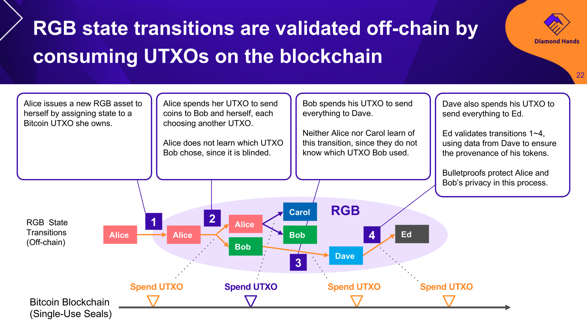
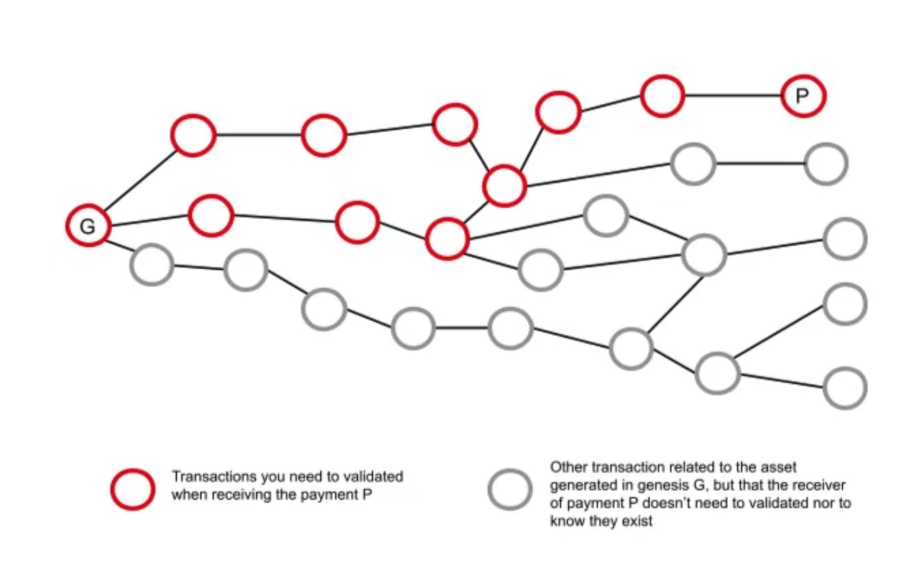
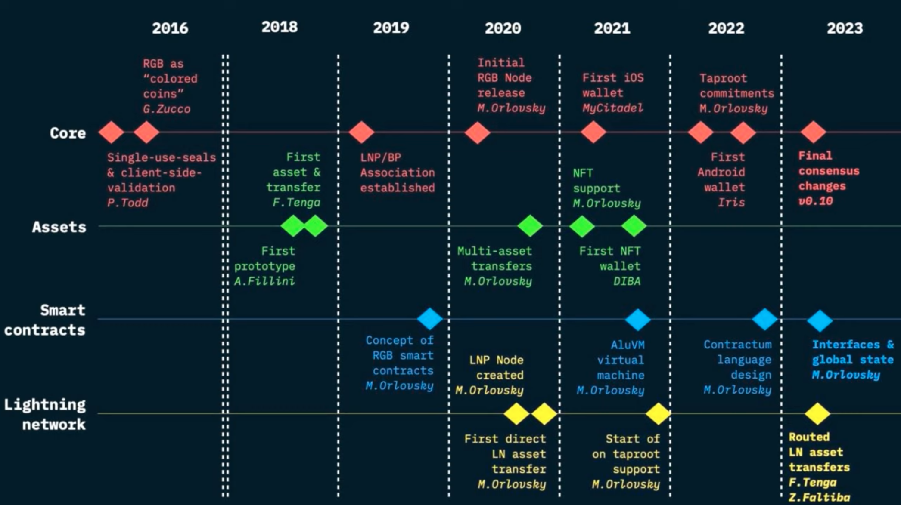

如果你之前看过 [Layer2 的文章](https://pmcrypto.xyz/blog/intro-of-layer2) 那你大概知道数据可用性对于区块链来说至关重要。数据可用性就是说，数据是否存在链上，是否是区块链 Global state 的一部分，如果不是，那就是存在链下，那么数据的安全性可能就无法得到保证，但是能够节省区块链很大的资源，提升处理交易的能力。

如果数据不存在区块链，但是同时又能够在一定程度上支持数据的验证来保证安全性呢？

## 客户端验证
首先你需要理解，你作为一个个人在使用软件的时候，你就是客户，所以装在你电脑里的软件就是客户端。比如你想打游戏，那你就要下载一个游戏客户端。那从哪里下载呢？一般是从游戏公司的服务器，他们是干服务的，所以他们那边是服务端。

那客户端和服务端有什么区别吗？对于一个游戏来说，什么东西应该放在客户端什么东西应该放在服务端来处理呢？

不影响游戏平衡核心数据的内容，比如说图像显示的质量，是放在客户端，让你的显卡处理的；核心的数据，比如说你放一个技能对面掉多少血；你跟对方交易分别有多少钱等这些内容是放在服务端。

<!-- truncate -->

那我为什么要说这个？主要是让你了解记住服务端这个玩意到底是什么大概意思。

让我们说会到区块链。比特币和以太坊都是服务端处理一切数据，也就是说你虽然装了一个它们的软件（比如说钱包），但是所有的数据比如地址有多少钱都是“服务端”，也就是链上传给你的数据，你的客户端不需要做太多工作，甚至不需要验证这些数据，解析完毕盲目详细就可以了。

那这样做的结果就是，你可能知道的概念：**所有工作都是链上完成**。链的工作量很大，负担很重所以能处理的内容就有限了。所以就需要扩容。后面的事情你应该就清楚了。Layer 2，模块化就都出来了。

好，说到这里，你应该明白了，客户端由于不用干什么事情，所以性能再好也不能解决区块链的性能，只能通过所有链的节点都提升性能才行。那这样的话，你再好的电脑跑比特币网络可能也是浪费。你用再垃圾的电脑跑比特币的钱包依然可以很流畅。这就是不用客户端做工作的好处。

（不像某些垃圾城市天际线2游戏，研发几年客户端用 4090 显卡玩一会儿也就能顶到 30 帧。）

如果你对比特币的客户端验证感兴趣，推荐你看看这个由 Diamond Hands 写的关于比特币客户端验证的报告 https://docsend.com/view/he8x9erkjmphphvn Diamond Hands 一方面做比特币技术开发，开发了一个支持 RGB 协议的钱包，同时也是日本的一个比特币社区。
 
## RGB 网络

说了这么客户端验证的事情，终于可以说到这个 RGB 协议了。首先 RGB 是一个支持智能合约的协议，这个也是它最大的目的所在。官方宣传，RGB 是一个比特币以及比特币闪电网络的智能合约+隐私扩展层。

所以 RGB 就可以被理解是一个搭建在比特币之上的智能合约网络，在这个网络协议里面支持发行 Token（就像在以太坊上发币一样）。目前 RGB 已经有了 Fungible 和 Non fungible 的 Token 标准。

那发了币，以及在 RGB 网络里面的交易信息被记录在哪里？又被谁验证来保证安全呢？为什么能够扩展性能和实现隐私呢？

简单理解，RGB 网络里面的一切交易都是发生在自己的网络里，BTC 网络上并没有类似于以太坊那样的每条交易的详细信息。当然，比特币网络也是不支持的。但是，RGB 网络的每一币交易信息的摘要/Commit 都会被记录在比特币网络里面。

那这是怎么记录的呢？

具体记录的方式是通过把 RGB 网络里面的每笔交易（对于比特币来说就是链下交易）信息生成一个 commitment，然后潜入到比特币的 UTXO 里面。注意，每一笔交易都有一个对应的 UTXO，也就意味着每笔交易在比特币网络上都能找到对应的数据。

至于是通过什么方式，记录具体哪些信息你可以暂时就不用管了。

 

<cite>图片来自 Dimond Hands 的报告</cite>

 

简单看上面的图，上面一行是 RGB 的交易，下面一行是比特币网络的交易。上面一行对应的每一笔交易都能够映射到比特币网络中的一个 UTXO（比特币交易的一部分）。

至于对应到哪一个 UTXO 就不一定了，只有所有人才能够对应上。所以对于比特币这个公开网络来说，你就算能够看到 RGB 的 Commitment，你也无法对应到 RGB 网络里的具体哪一笔交易，所以隐私就可以有保证。

那么剩下一个问题就来了，既然 RGB 是链下的，所有的交易是怎么验证的呢？诶，这就说会到了一开始的客户端。RGB 交易都是在客户端验证的，也就是交易的用户自己去验证。比如说你收到了一个 RGB 网络币的交易，你想要验证这个币是不是真的存在或者说数量具体对不对。这时候你就需要给你转账的人提供你这个交易的 Commitment 以及一路上一直到源头的 Commitment 在比特币网络上的具体位置。

是不是听起来不好理解，看下面的图你就明白了。

<cite>来源：https://medium.com/@FedericoTenga/understanding-rgb-protocol-7dc7819d3059</cite>

 
你想要验证上图里面红圈 P 的交易，那你需要给你转账的人从 P 一直往上一切有关的点，也就是图里所有红圈的信息都提供出来，这样你就可以去比特币网络验证所有的 Commitment。而这个验证过程是链下完成的，不需要用到比特币网络的计算/存储资源。

最核心你需要理解的就是：

> 在 RGB 网络可以创建智能合约了，但是智能合约创建的状态被记录在了比特币的链（UTXO）上。智能合约的状态变化，也会通过比特币 UTXO 的形式被记录在比特币链上。但是智能合约本身是在链下(对于比特币来说)创建的，智能合约转账交易的行为本身也是发生在链下。

## 现在发展到什么样子了？

因为 BRC20 的发展，这个概念最近慢慢关注的人多了起来。目前总体来看还是很不完善的，RGB 在 7 个月之前发布了 v0.10 版本，在 2 个月之前修修补补正式对外宣布 v0.10 版本稳定可用。

现在生态里面有：
- 安卓钱包 https://play.google.com/store/apps/details?id=com.iriswallet.testnet
- 网页钱包 https://bitmask.net/
- 浏览器：https://rgbex.io/

当然还有其他项目，在这个 Github 里面统计了一些关于 RGB 相关的资料，有兴趣可以去看看 https://github.com/22388o/awesome-rgb-protocol

对了 RGB，一方面是 red green blue，所以你能发现这个项目的 Logo 就是这三个颜色。另外，rgb 真正代表的含义是：really good bitcoin..