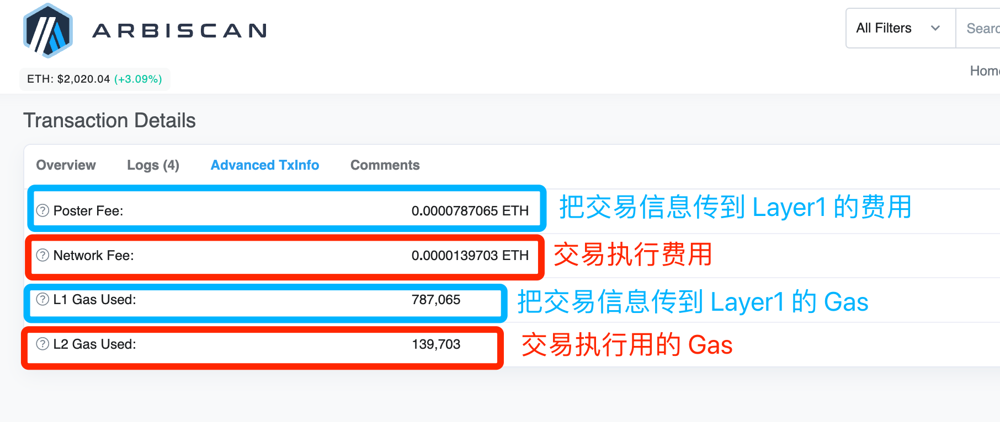

## 什么是数据可用性

这个词汇你应该听到不是一次两次了，数据可用性 Data Availability 最简单的方式理解就是，对于区块链的任意数据，主网的节点能不能获得这个信息，这个区块链里面的交易信息是否是完全对所有人公开透明的？

传统（一体式）的区块链模型，交易的执行和存储都是在主网，就像以太坊，但是大家发现这样太贵了。你让全世界几万个节点去处理你那一笔 10 U 的交易，确实是有点奢侈。

但是没办法，区块链的特点就是这样，就是要大家一起来处理才行，不然有些交易就会出问题。那这样一分钟之内也处理不少交易啊，而且还贵。

记住，一定要记住，交易贵的最核心原因就是让几万个节点去一起做一件事情：验证这笔交易。

<!-- truncate -->

这样的结果就是

- 交易执行所有节点一起做（主网进行）
- 交易处理完毕之后数据存储（谁有多少钱之类要存下来）在链上（主网进行）

那有没有什么办法便宜一点呢？

有的，Layer 2.

## Layer 2 把交易执行放在链下

刚说了一个交易确认需要执行和存储，那我们能不能把交易执行放在链下，然后把执行的结果放到链上就行了呢？可以的。

Layer 2 就是这么做的，这样主网就不用做交易执行了，这样理论上是能够便宜很多的，而事实上也是这样。

那存储呢？很遗憾，交易的存储还是要放在主网，也就是主网的节点要能够验证这个信息，注意啊，是验证，不是执行，只要让主网在需要验证的时候能够验证就好了。

所以 Layer 2 的本质是，把交易的执行放在链下，然后把交易执行的结果放在链上。所以如果你仔细看 Arbitrum 的浏览器，你能够发现任意一笔 Layer2 的交易，都有一个 Layer1 的费用。

而且你能发现，大部分的费用其实都用在了这个交易信息的存储方面。所以 Layer 2 的交易还是贵。

## 为什么要这么做呢？

很简单，如果不这么做的话，Layer 2 骗人怎么办？

<blockquote>
上学的时候老师要检查作业，你上课说你没带作业，但是你写完作业拍了个照片。老师要的时候，你说你写了，有照片为证。

老师看了照片，老师怎么知道你的照片是什么时候照的？是不是 P 的？是不是你的作业照片？

另外，你手机哪来的？
</blockquote>

所以除了照片，你还需要提供额外的信息，比如做完作业之后拍一个视频视频里拍清楚时间地点，作业的情况以及其他能证明你确实写了作业的信息。

视频还是能伪造的哈，这里只是用于简单解释，明白意思即可。

## CallData

CallData 就是 Layer1 利用 Layer2 提交的数据，去拿到实际的交易信息的过程，你也可以理解为就是老师上课检查你没有带的作业的过程。

因为 Layer2 只是执行，实际的交易信息还是存到 Layer1 的，所以 Layer1 就可以通过 CallData 获取数据来验证 Layer2 的交易是不是有问题。

那既然现在大部分的费用都用在数据的存储了，我们让存储的数据小一点，是不是就会便宜点呢？

没错！

<blockquote>
老师规定如果没带作业，或者不想带作业的，拍视频里面要包括，时间地点任务，作业内容等。标准的拍法是：

“我是 Wayne，今天是 2023 年 11 月 20 号，天气晴。我是打火机高中三年二班的学生，今天我要拍的作业是**** balabala”
</blockquote>

本来这样一套下来视频要拍 3 分钟，现在我们给缩短，把每个同学都要说一样的话标准化一点，减少一点内容，变成

<blockquote>
“Wayne，2023 年 11 月 20 号，晴。打火机三二班，作业是**** balabala”
</blockquote>

Layer 2 的交易也是类似的道理，数据少一点，花费就少一点。

所以你能够看到 Arb 和 Op 都有搞自己的数据压缩

- https://medium.com/ethereum-optimism/the-road-to-sub-dollar-transactions-part-2-compression-edition-6bb2890e3e92

- https://research.arbitrum.io/t/compression-in-nitro/20

现在明白了吗？

**数据可用性就是主网必须要能够获得不在主网执行的交易数据，来保证主网的所有交易都是没问题的。因为要上传数据，所以 Layer2 的交易还是贵。但是把数据压缩压缩是可以减少这部分的成本的。**

但是新的问题又出现了，哪那么好压缩啊。

交易类型那么多，有交易，有借贷，有抵押，有 NFT，还有上当受骗的。所以并不好压缩，也就是压缩能实现的节省是挺有限的。

所以我们看到了很多新的 DA 解决方案出来想解决这个问题。

而这个问题也是模块化区块链的重要成分之一。

以太坊的 Danksharding 就是来解决这个问题，让 CallData 的成本降低一些，用一个叫做 KZG 的数据压缩方法。 

---

当然，还有一个思路是不用标准化的方法压缩所有的交易，因为一个转账交易和一个 Swap 的交易两个类型共同点肯定没有两笔转账交易的多。

所以也可以考虑针对部分高频的进行压缩，比如说针对 Uniswap 的交易进行更多的压缩，而其他类型的和这个不一样。

想看 Dangsharding 的可以看这个 https://ethereum.org/en/roadmap/danksharding/