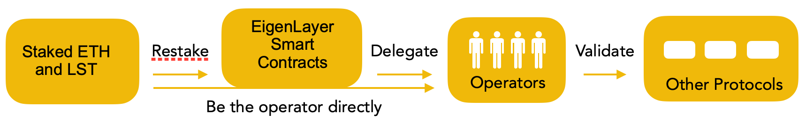
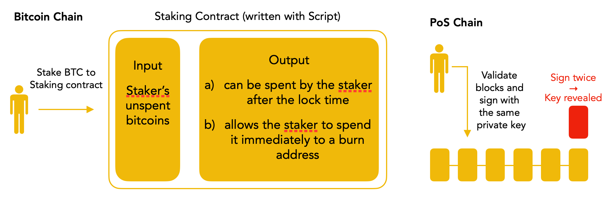
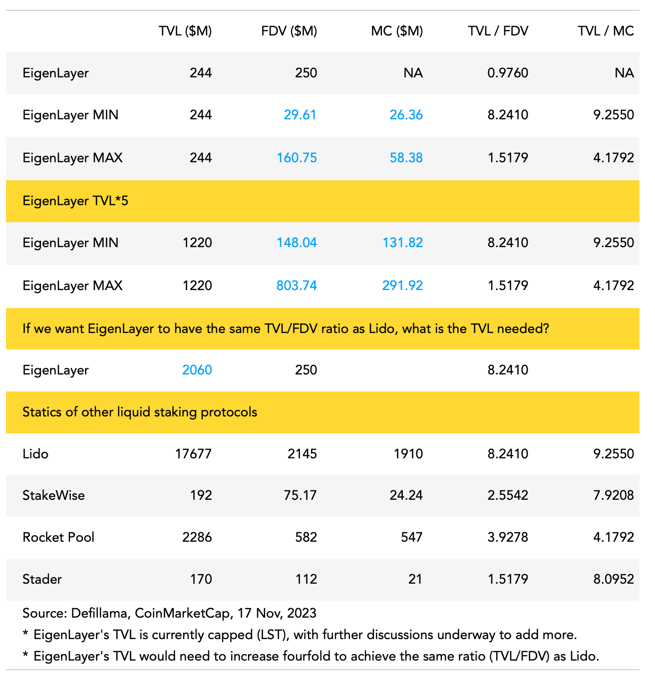

[**Download PDF** ](./Eigenlayer_Babylon_Research_by_pmcrypto.pdf)

## Background

### The core value of a blockchain is the TRUST it created by its consensus mechanism

Bitcoin was created as a Peer-to-Peer cash system, and its biggest accomplishment was solving the double-spending problem. Proof of Work (PoW) is used as the consensus mechanism to establish a global consensus regarding the order of transactions. Everyone holds the same ledger, and it is completely open and decentralized.

The elegant design of the consensus mechanism establishes the fundamental trust of Bitcoin. It is a system that enables users/nodes from all over the world, who are complete strangers, to collaborate as intended. Tokens serve as economic incentives to ensure the smooth operation of this system.

<!-- truncate -->

Before The Merge, Ethereum was similar to Bitcoin in terms of the consensus mechanism. It transitioned to Proof of Stake (PoS) after the Paris Upgrade. Instead of relying on nodes' hash power to produce new blocks, it now depends on the amount of ETH being staked.

After years of development, it is now nearly impossible to attack or fork Bitcoin and Ethereum. A Substantial amount of “real money” has been invested in these two systems to secure them and validate transactions. In the case of Bitcoin, this involves the computational power brought by mining hardware. For Ethereum, it involves more than 28 million $ETH (over $56 billion USD) being staked.

### Re-use the TRUST

Now that trust has been established, how can it be utilized? Bitcoin primarily focuses on one simple purpose: transferring bitcoins, limited by the non-Turing complete Script language. However, Ethereum offers much more. With the invention of the Solidity programming language, developers can write smart contracts and build various applications on top of the Ethereum network. Nonetheless, Ethereum faces limitations, such as the low transaction-per-second (TPS) problem. The trust layer has limited block space available for developers.

To address these challenges, we have witnessed the emergence of numerous alternative chains and Layer 2 solutions aimed at scaling Ethereum or Bitcoin. Besides developing their own ecosystems, are there other ways to fully leverage the existing trust?

One such project is EigenLayer, a protocol seeking to create a decentralized trust marketplace on Ethereum. It enables the reuse of ETH already staked in the network for new crypto networks through a process called restaking. Another project is Babylon, a Bitcoin staking protocol that allows Bitcoin holders to stake their coins in a trust-less manner while keeping them on Bitcoin chain.

## Product mechanism

### Extra Slashing conditions

In the blockchain ecosystem, every node has a basic economic incentive: if a node or validator behaves correctly by validating transactions and securing the network, it will receive a reward. However, if a node becomes malicious and attempts to attack the network, it should be subjected to punishment (slashing).

In Ethereum's consensus mechanism, if a validator attempts to sign two blocks at the same height, the validator will be slashed. This means his/her staked ETH will be reduced as a feasible economic penalty.

Therefore, in order to rehypothec the trust from Bitcoin and Ethereum to other platforms, it is necessary to implement slashing conditions that incentivize and disincentivize validator behavior. These conditions play a crucial role in maintaining the integrity and security of the network by penalizing malicious actors and ensuring that validators act in the best interests of the system. (Please read Appendix 1 for more background information.)

### EigenLayer

EigenLayer has introduced a novel concept called "restaking," which enables validators or users who have already staked their ETH within the network to re-stake their staked ETH (LST) into the EigenLayer protocol. This restaked ETH is then utilized to secure other platforms. By leveraging the restaked ETH, EigenLayer establishes an operator system comprising operators who carry out the actual validation work for other protocols.

This restaking process allows for the reuse of staked ETH. Users who choose to restake their ETH receive additional yield in addition to the rewards they already earn from staking ETH. This is because they are providing validation services for other protocols. However, it's important to note that obtaining the extra yield also comes with additional risk. Users must willingly opt-in and be prepared to adhere to the extra slashing conditions associated with the restaking process.

EigenLayer protocol builds a marketplace for protocols seeking validation services, known as Actively Validated Services (AVS). Protocols that require such services can now directly rent or purchase them from EigenLayer, allowing them to focus on developing business logic on top of the established trust layer.

EigenLayer emphasizes that bootstrapping the consensus layer and establishing trust is a resource-intensive task. By creating a marketplace for validation services, EigenLayer aims to offer a more efficient and cost-effective solution for protocols seeking to leverage the existing trust and security within the EigenLayer ecosystem.

### Governance of extra slashing of EigenLayer

There are two layers of governance in the extra slashing part. The first layer is the on-chain governance, which involves the economic incentives mentioned above. Validators receive rewards or face slashing based on the code written on-chain. It's worth mentioning that different protocols may require different types of Actively Validated Services (AVS) in the trust marketplace. This means that the AVS can be customized, and the slashing conditions can be negotiated and then written on-chain.

The second layer of governance is the social layer. If a situation arises that cannot be addressed by the predefined slashing conditions, there will be an off-chain veto committee to resolve it.

## Babylon

For EigenLayer, as it is built on top of Ethereum, implementing extra slashing conditions is easy with the help of smart contracts. However, Babylon faces a different situation as Bitcoin does not support smart contracts.

### What does Babylon want to achieve?

- Malicious validator will be slashed using Bitcoin’s non-Turing Complete programming language

- Ensuring the safety of staked bitcoins: a) all bitcoins remain in the Bitcoin chain without the need for bridges; b) individuals who stake bitcoins retain control of their private keys (no custody).

### How to achieve the goals?

Although Bitcoin does not have smart contracts, its programming language still allows for expressing specific conditions for spending BTC within the UTXO. For example, the staking period (lock time) can be expressed using the OP_CHECKSEQUENCEVERIFY opcode, as stated in the Babylon whitepaper.

Therefore, if holders want to stake their bitcoins, they can send a transaction with the input being their bitcoins and the output having two possible cases as shown in the graph above. In either case, holders retain control of their bitcoins by holding their private keys.

If the staker behaves properly, the bitcoins will be unstaked after the lock-in period. However, if the staker acts maliciously and attempts to sign two blocks at the same height, their private key will be exposed to the public, allowing anyone to spend the unspent bitcoins in the staking contracts.

Babylon utilizes extractable one-time signatures (EOTS) to achieve this. The idea is that you can sign a message once, similar to normal signature schemes. EOTS requires an additional tag parameter, which, in this case, is the block height. If you try to sign the same message twice with the same tag (signing two blocks at the same height), your private key can be extracted from the two signatures.

### Babylon Chain

Once the biggest challenge is solved, Babylon is able to build a Bitcoin Staking protocol with Babylon chain itself works as the middle layer between Bitcoin and other protocols. As the communication channel, Babylon chain will pass the other chains data (block hashes and signing info) to Bitcoin chain. Once the data is written in Bitcoin blockchain, the security is guaranteed. The communication is actually the process of synchronization using the Bitcoin timestamping. 

### Shared security

By leveraging the mechanisms described above, EigenLayer and Babylon tap into the well-established trust frameworks of Ethereum and Bitcoin. 

This empowers them to extend their services to other protocols, fostering a decentralized trust marketplace. Instead of undertaking the cumbersome task of building their own node systems and bootstrapping the consensus layer, protocols in need of trust services can seamlessly access a unified trust pool. This approach eliminates the fragmentation of PoS trust pools and ensures the high level of security (as high as Ethereum or Bitcoin).

### Risks

The protocol design of both projects have various risks, with one notable concern being the potential strain on the consensus mechanisms of Ethereum and Bitcoin, or the 'social consensus pressure.' If a significant amount of value is protected by the shared trust layer, and an issue arises that is considered more critical than Ethereum's consensus, such as a real-world political matter, a social fork could be implemented. Despite Ethereum being fundamentally sound, it might undergo a fork. The concept of trust sharing poses both a potential threat to the original chains and a challenge to decentralization.

## Value Proposition

For both EigenLayer and Babylon, they require three types of participants:

- Restakers/Stakers: Users who are willing to restake ETH or stake BTC as a source of security.

- Operators/Validators: Chain operators who provide additional validation services for new protocols.

- Developers/protocols: The "customers" who require staking security services, such as new PoS chains, bridges, and data availability solutions.

The first two are essential for EigenLayer and Babylon to provide services to their target customers. Leveraging the existing trust and security within EigenLayer and Babylon helps eliminate the need to bootstrap the consensus layer, reducing costs. Additionally, in theory, the BTC staked in the Babylon protocol could be restaked in EigenLayer.

The final issue is determining how strong the target users' willingness to pay for the services is.

For EigenLayer, the advantage lies in its alignment with Ethereum. Ethereum has the largest ecosystem in the crypto space, which translates to more users and greater demands. EigenLayer's solution has the potential to address the limitations of Ethereum, such as the need for secure and decentralized bridges, data availability solutions, and a decentralized sequencer layer for Layer 2 solutions. Using ETH as the staking asset is considered "politically correct" within the Ethereum ecosystem.

Regarding Babylon, as stated on its website, the targets are new PoS chains and existing PoS chains seeking increased security. While there are numerous PoS chains, it cannot be expected that more than 100 PoS chains will emerge every year, and not all of them will utilize the services. However, there could be over 1000 protocols within the entire ecosystem, with the majority being ETH/EVM-related. In a modular blockchain world, the number of chains will be significantly less than the number of modular protocols addressing specific problems.

Another challenge faced by both protocols is that applying the trust layer eliminates the need to stake protocols' native tokens. On the positive side, protocols are not vulnerable due to the low value of their tokens. If the native token is used, a low value makes it cheaper and easier to attach the consensus. This can overcome the "death spiral" where a token's price decline makes the system more vulnerable.

However, staking is a powerful way to create use cases for tokens and lock up liquidity, reducing selling pressure and improving price performance. Additionally, as a new chain grows larger and stronger, trusting a third party may no longer be the best option. EigenLayer did come up with a dual staking idea where ETH and native tokens both accepted as staked asset. But it is just an idea yet.

In summary, EigenLayer targets a larger and more diverse user base. In addition to chains, the mentioned services have the potential to be adopted by many entities. Ethereum alignment is another crucial factor driving adoption. There are already some early projects building on EigenLayer.

## Competitive Advantage

If we are being optimistic, restaking or shared security could be a significant narrative in the crypto space. These two protocols are the pioneers in this field. However, if other competitors enter the game, will they be surpassed by new players? Well, probably not.

Security is a highly sensitive sector in crypto. One strategy that new players can employ is to provide higher yields with token incentives, similar to the vampire attack conducted by SushiSwap against Uniswap. However, the safety of funds is usually more important than higher yields. Additionally, in crypto history, the first protocol of its kind typically maintains its top position: Uniswap, AAVE, GMX, and Lido.

## Final Thoughts

EigenLayer and Babylon are both decent projects. EigenLayer is building a decentralized trust marketplace on Ethereum by leveraging the existing trust within the Ethereum ecosystem. Babylon aims to unlock idle bitcoins on the Bitcoin chain and develop a staking protocol to serve as a trust layer for new protocols. There are many similarities between these two protocols.

However, from an investment perspective, I personally lean towards investing in EigenLayer rather than Babylon. The specific reasons for this preference include:
EigenLayer has a better market fit and there are already more than 120k $ETH ($244M) restaked.

- The overloading Ethereum’s consensus and centralized risks exist but can be mitigated by a close conversation with Ethereum foundation (it is already on-going) and scaling control by the team.

- Babylon in theory can solve the additional slashing condition and non-custody of bitcoins issues, while we don’t know in practice the willingness of Bitcoin holders to stake their bitcoins and how the code works.

- Based on the speeches and panel discussions       I watched about the two team, EigenLayer’s team, especially the founder has a better communication with the community.

- It is a fact that there are already many protocols are been built on top of EigenLayer. Ethereum ecosystem has the biggest communities and users. Politically correct of being Ethereum alignment is also a quite important reason.

- Bitcoin is a reserve asset. Although there are scaling solution / L2, and BRC20 projects in the Bitcoin ecosystem, touching holders’ bitcoins is still not the best idea. 
Babylon’s success also relies on the development of Cosmos ecosystem to start the first step.

- EigenLayer’s TVL would need to increase fourfold to achieve the same ratio (TVL/FDV) as Lido. 

