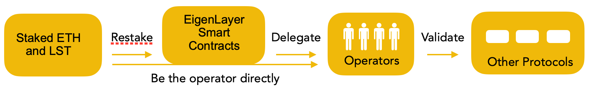
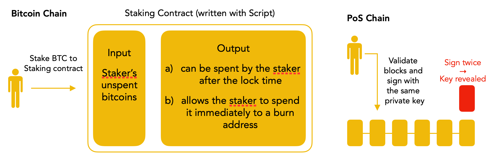
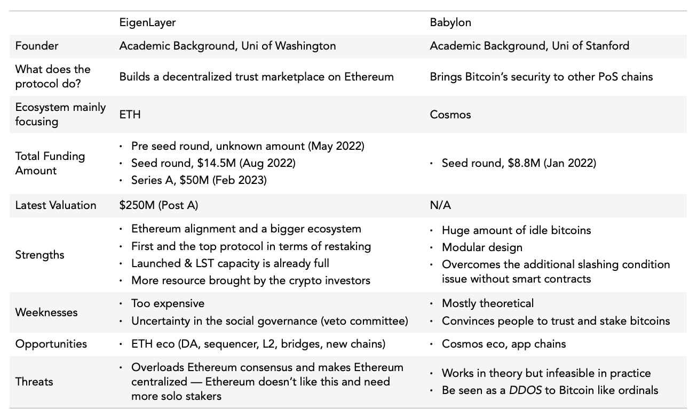
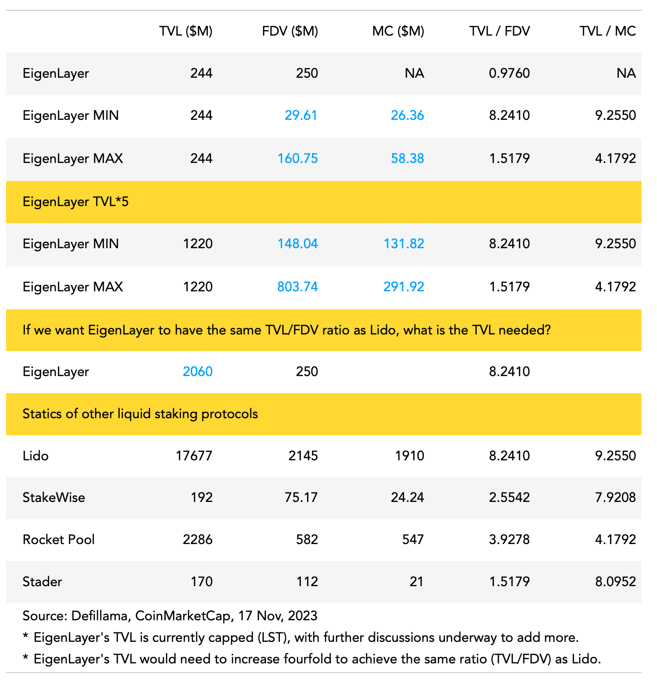

:::info

本篇原文我一开始写的是英文，以下中文是用 GPT 再加上我简单修改了一下。所以中文读起来并不会像之前写的中文一样那么顺。如果你想阅读英文的原文，可以点击这个[**链接**](http://pmcrypto.xyz/blog/wtf-is-eigenlayer-and-babylon)

[**下载英文 PDF** ](./Eigenlayer_Babylon_Research_by_pmcrypto.pdf)
:::

## 背景

### 区块链的核心价值在于由其共识机制所创造的信任。

比特币作为一个点对点的现金系统而创建，其最大的成就是解决了双花问题。共识机制 PoW，工作量证明最核心的价值就是能够给交易排序，并且是在一个全世界统一的账本/记录上给交易排序，并且产生共识。这样使得每个人都持有相同的账本，而且它是完全开放和去中心化的。

共识机制的优雅设计建立了比特币的基本信任。它是一个使来自全球各地、完全陌生的用户/节点能够按照预期进行协作的系统。代币作为经济激励，确保了该系统的顺利运行。

<!-- truncate -->

在合并之前，以太坊在共识机制方面与比特币类似。在巴黎升级之后，它过渡到了权益证明（PoS）。现在，它不再依赖节点的哈希算力来生成新的区块，而是依赖于质押的 ETH 数量。

经过多年的发展，攻击或分叉比特币和以太坊现在几乎是不可能的。大量的“真实资金”已被投资于这两个系统以确保它们的安全性和交易的验证。对于比特币而言，这涉及到由挖矿硬件带来的计算能力。对于以太坊而言，这涉及到超过 2,800 万 ETH（超过 560 亿美元）的质押。

### 信任层的二次利用

既然信任已经建立，如何利用它呢？比特币主要关注一个简单的目标：传输比特币（受到非图灵完备的脚本语言的限制）。然而，以太坊提供了更多的功能。通过发明 Solidity 编程语言，开发人员可以编写智能合约，并在以太坊网络上构建各种应用。然而，以太坊面临一些限制，例如低交易每秒（TPS）的问题。信任层对于开发人员来说可用的区块空间有限。

为了解决这些挑战，我们目睹了许多旨在扩展以太坊或比特币的替代链和第二层解决方案的出现。除了开发自己的生态系统，是否还有其他方式可以充分利用现有的信任呢？

其中一个项目是 EigenLayer，这是一个旨在在以太坊上创建去中心化信任市场的协议。它通过一种称为 "restaking" 的过程，使已经在网络中质押的 ETH 可以为新的加密网络进行再利用。另一个项目是 Babylon，这是一个比特币质押协议，它允许比特币持有者在保持其在比特币链上的同时以无需信任的方式进行质押。

## 项目机制

### 额外的惩罚条件 Slashing conditions

在区块链生态系统中，每个节点都有一个基本的经济激励：如果一个节点或验证者正确地验证交易并保护网络安全，它将获得奖励。然而，如果一个节点变得恶意并试图攻击网络，它应该受到惩罚（减持）。

在以太坊的共识机制中，如果一个验证者试图在同一高度上签署两个区块，该验证者将被减持。这意味着他/她质押的ETH将会减少，作为一种可行的经济惩罚。

因此，为了将比特币和以太坊的信任再利用到其他平台上，有必要实施一些既有激励又有惩罚的减持条件来激励和约束验证者的行为。这些条件在维护网络的完整性和安全性方面发挥着关键作用，通过惩罚恶意行为者并确保验证者为系统的最佳利益行事。

### EigenLayer

EigenLayer 引入了一种新颖的概念，称为 "重新质押"（restaking），它使已经在网络中质押了 ETH 的验证者或用户能够将其质押的 ETH（LST）重新质押到 EigenLayer 协议中。重新质押的 ETH 将被用于保护其他平台。通过利用重新质押的 ETH，EigenLayer 建立了一个由运营者组成的系统，这些运营者为其他协议执行实际的验证工作。

这种重新质押的过程允许质押的 ETH 得到再利用。选择重新质押 ETH 的用户将获得额外的收益，除了他们已经从质押 ETH 中获得的奖励之外。这是因为他们为其他协议提供了验证服务。然而，需要注意的是，获取额外收益也伴随着额外的风险。用户必须自愿选择并准备遵守与重新质押过程相关的额外减持条件。

EigenLayer 协议为寻求验证服务的协议构建了一个市场，称为主动验证服务（AVS）。需要这类服务的协议现在可以直接从 EigenLayer 租用或购买，从而使它们能够专注于在已建立的信任层之上开发业务逻辑。

EigenLayer 强调，启动共识层并建立信任是一项资源密集型的任务。通过创建验证服务的市场，EigenLayer 旨在为寻求利用 EigenLayer 生态系统中现有信任和安全性的协议提供更高效和具有成本效益的解决方案。

### 额外惩罚条件的治理机制

在额外减持部分，有两个层面的治理。第一层是链上治理，其中涉及上述经济激励。验证者根据链上的代码获得奖励或面临减持。值得一提的是，不同的协议可能需要不同类型的主动验证服务（AVS）在信任市场中。这意味着 AVS 可以进行定制，并且减持条件可以进行协商，然后写入链上。

第二层是社会层面的治理。如果出现无法通过预定义的减持条件解决的情况，将会有一个链下否决委员会来解决。

## Babylon

在 EigenLayer 的情况下，由于它是构建在以太坊之上的，通过智能合约实现额外的减持条件是相对容易的。然而，Babylon 面临着不同的情况，因为比特币不支持智能合约。

### Babylon 想要实现什么效果？

- 恶意节点干坏事会被惩罚，而且是在比特币非图灵完备的语言基础上实现
- 质押的比特币足够安全，非托管而且还在比特币链上，没有跨链

### 怎么实现？

虽然比特币没有智能合约，但它的编程语言仍然允许在未花费交易输出（UTXO）中表达特定的条件。例如，锁定时间可以使用 OP_CHECKSEQUENCEVERIFY 操作码来表示，正如 Babylon 白皮书中所述。

因此，如果持有者想要质押他们的比特币，他们可以发送一笔交易，其中输入是他们的比特币，输出具有如上图所示的两种可能情况。在任何情况下，持有者通过持有私钥保留对他们的比特币的控制权。

如果质押者表现正常，比特币将在锁定期结束后解锁。然而，如果质押者行为恶意，并尝试在相同高度签署两个区块，他们的私钥将被公开，使任何人都能花费质押合约中未花费的比特币。

Babylon 利用了可提取的一次性签名（EOTS）来实现这一点。其核心思想是用户可以对消息进行一次签名，类似于普通的签名方案。EOTS 需要一个额外的标签参数（验证区块的时候签名额外参数就是区块高度）。如果用户尝试使用相同的标签对相同的消息进行两次签名（在相同高度签署两个区块），用户的私钥可以从这两个签名中提取出来。

### Babylon Chain

一旦最大的挑战得以解决，Babylon 就能够构建一个基于比特币的质押协议，其中 Babylon 链本身作为比特币和其他协议之间的中间层。作为通信渠道，Babylon 链将传递其他链的数据（区块哈希和签名信息）到比特币链上。一旦数据被写入比特币区块链，安全性就得到了保证。通信实际上是使用比特币的时间戳同步的过程。

### 共享安全

通过利用上述描述的机制，EigenLayer 和 Babylon 利用了以太坊和比特币的成熟信任框架。这使它们能够将其服务扩展到其他协议，促进了去中心化信任市场的发展。与构建自己的节点系统和引导共识层的繁琐任务不同，需要信任服务的协议可以无缝访问统一的信任池。这种方法消除了 PoS 信任池的碎片化，并确保了与以太坊或比特币一样的高水平安全性。

### 风险

这两个项目的协议设计存在各种风险，这里只说其中一个显著的关注点是对以太坊和比特币共识机制的潜在压力，即“社会共识压力”。如果大量价值受到共享信任层的保护，并且出现了被认为比以太坊共识更为重要的问题，例如现实世界的政治问题，可能会实施社会分叉。尽管以太坊在根本上是健全的，但它可能会经历分叉。信任共享的概念既对原始链条构成潜在威胁，也对去中心化构成挑战。

因此，这两个项目在设计和实施协议时需要仔细考虑和应对这些风险。强大的治理机制、社区参与以及持续监控和适应可以帮助减轻这些挑战，并确保项目的长期成功和可持续性。

## 价值

对于 EigenLayer 和 Babylon，它们需要三种类型的参与者：

- 重新质押者/质押者：愿意重新质押 ETH 或者质押 BTC 作为安全来源的用户。
- 操作者/验证者：链操作者为新协议提供额外的验证服务。
- 开发者/协议：需要质押安全服务的 "客户"，例如新的 PoS 链、桥接以及数据可用性解决方案。

前两者对于 EigenLayer 和 Babylon 向目标客户提供服务至关重要。利用 EigenLayer 和 Babylon 内部现有的信任和安全性有助于消除引导共识层的需求，降低成本。此外理论上，Babylon 协议中质押的 BTC 可以重新质押在 EigenLayer 中。

最后一个问题是确定目标用户对服务的支付意愿有多强。

对于 EigenLayer 来说，其优势在于与以太坊的一致性。以太坊在加密货币领域拥有最大的生态系统，这意味着更多的用户和更大的需求。EigenLayer 的解决方案有潜力解决以太坊的局限性，例如需要安全且去中心化的桥接、数据可用性解决方案以及 Layer 2 解决方案的去中心化序列层。在以太坊生态系统内，使用 ETH 作为质押资产被认为是“政治正确”的做法。

至于 Babylon，根据其网站上的说明，其目标是新的 PoS 链和现有的寻求增加安全性的 PoS 链。虽然存在众多 PoS 链，但不能指望每年会出现超过 100 条 PoS 链，也不是所有链都会利用这些服务。然而，在整个生态系统中可能存在超过 1000 个协议，其中大部分与 ETH/EVM 相关。在模块化区块链世界中，链的数量将远远少于解决特定问题的模块化协议的数量。

EigenLayer 和 Babylon 面临的另一个挑战是，应用信任层会消除质押协议本机代币的需求。积极的一面是，由于代币价值较低，协议不会因此而受到攻击。如果使用本机代币，低价值使得附加共识变得更便宜和更容易。这可以克服“死亡螺旋”，即代币价格下跌使系统更加脆弱的情况。

然而，质押是创建代币使用案例和锁定流动性的强大方式，减少抛售压力并改善价格表现。此外，随着一个新的链变得越来越大和强大，信任第三方可能不再是最佳选择。EigenLayer 提出了一种双重质押的想法，即 ETH 和本机代币都可以作为质押资产接受。但这只是一个想法而已。

总结起来，EigenLayer 的目标用户群更大且更多样化。除了链外，提到的这些服务有潜力被许多实体采用。与以太坊的一致性是推动采用的另一个关键因素。已经有一些早期项目在 EigenLayer 上进行构建。

## 对比

如果我们持乐观态度，重新质押或共享安全性可能成为加密货币领域的重要叙事。这两个协议是该领域的先驱者。然而，如果其他竞争对手进入游戏，它们会被新玩家超越吗？嗯，可能不会。

安全性是加密领域一个非常敏感的领域。新玩家可以采用的一种策略是通过代币激励提供更高的收益，类似于 SushiSwap 对 Uniswap 发起的吸血鬼攻击。然而，资金的安全性通常比较高收益更为重要。此外，在加密历史上，同类中的第一个协议通常保持其顶级地位：Uniswap、AAVE、GMX 和 Lido。

## Final Thoughts

EigenLayer 和 Babylon 都是不错的项目。 EigenLayer 正在通过利用以太坊生态系统内的现有信任关系，在以太坊上构建一个去中心化的信任市场。 Babylon 旨在解锁比特币链上的闲置比特币，并开发一个质押协议作为新协议的信任层。 这两个协议之间有许多相似之处。

然而，从投资的角度来看，我个人更倾向于投资 EigenLayer 而不是 Babylon。 这种偏好的具体原因包括：

- EigenLayer 有更好的市场适应性，已经有超过 120,000 个 ETH （价值 244 百万美元）被重新质押。
- 超载以太坊的共识和中心化风险存在，但可以通过与以太坊基金会的密切对话（这已经在进行中）和团队的扩展控制来减轻。
- Babylon 在理论上可以解决附加的惩罚条件和比特币非托管的问题，但我们不知道实际上比特币持有者质押比特币的意愿以及代码如何运作。

- 根据我观看的关于这两个团队的演讲和专题讨论，EigenLayer 团队，特别是创始人，与社区的沟通更好。

- 事实上，已经有许多协议在 EigenLayer 上构建。以太坊生态系统拥有最大的社区和用户。作为与以太坊一致性的“政治正确”也是一个相当重要的原因。

- 比特币是一种储备资产。尽管比特币生态系统中存在扩展解决方案/L2 和 BRC20 项目，但触及持有者的比特币仍然不是最好的选择。
- Babylon 的成功也依赖于 Cosmos 生态系统的发展来启动第一步。

- EigenLayer 的总锁定价值（TVL）需要增加四倍才能达到与 Lido 相同的比例（TVL/FDV）。

