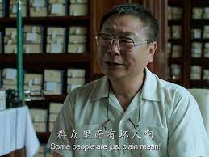
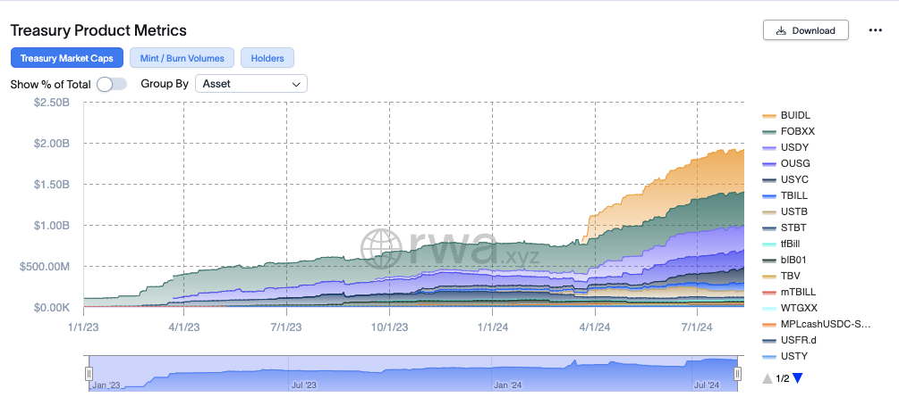
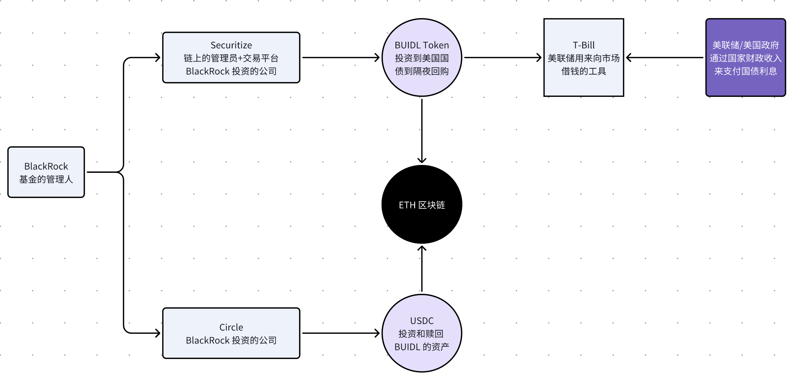

这个是今天看了一下 BUIDL 的个人笔记，本来以为这个东西很简单，就是机构发的一个自己的产品。但是看着看着发现还是有一些之前不知道的东西，所以干脆就简单整理一下发出来分享分享。

关于 RWA 的概念绝大部分人都很清楚，不过这个名字起的其实不是那么好。Real World Asset，听起来好像是在说 RWA 之前的 Crypto 资产都不是 Real 的。

本质上讲 RWA 资产有两个方向：

- 一个是 Crypto 的资产投资到现实世界的资产当中去 --- 不好，因为会让 Crypto 的资产流失。

用户直接使用 USDC / USDT 来投资被 Token 化的美国国债，或者其他现实资产，这样这部分资金其实本质上是跑出 Crypto 内部流通之外了。比如有不少项目做的 RWA，普通人都可以用 USDC / USDT 直接购买。

- 一个是外部资产以 Token 化的方式投资现实世界的资产 --- 好，因为钱流进来了。

<!-- truncate -->

本质上是传统资产世界的投资行为，一部分被放到了 Crypto 平台上进行。这样的形式使得本来是传统世界就已经完成的操作，现在放在链上了，最终的权益凭证放在链上。那既然权益凭证放到了链上，一个是链上的资产价值增加，另外一个是权益凭证是有潜在的可能直接在链上进入真正的 Crypto 世界。（如果读起来比较乱，别着急，后面会详细介绍。）

从资金流向上总结，RWA 一种是你可以用钱包的钱去投资别人做的 RWA，这样钱就出去了，你的 USDC / USDT 就不能在放到 DeFi，冲 MEME 等里面。 有点类似于你通过一些三方公司用你的人民币买了美国的股票，这样人民币资产外流了就。

一种是把 RWA 的权益凭证放在链上，也就是现实资产的资金，美金还在传统机构手中，但是这个美金，以及美金投资的资产凭证被放到了链上。有点类似于，虽然投资人投资的是比特币 ETF，但是实际上 ETF 背后需要比特币支撑，投资人的钱就流入了真正的比特币市场（不是特别准确，但是大概是这个意思）。

此前，我们看到的大部分 RWA 项目，本质上面向的都是 Crypto 内部的投资人，只要是说可以用 USDT/USDC 可以投资的都基本属于这一类。这属于是“群众里面有坏人”，本来市场就不景气，还吸引大家把钱弄出去。

今天主要要聊的是 BUIDL，BlackRock 的 RWA 基金。

## T-Bill RWA 的规模

在此之前，我们先来看一下基于美国国债的 RWA 市场规模。

- 总规模：1.92B

- 平均收益率：4.94%

因为有 BlackRock 的加持，第一名毋庸置疑已经是 BUIDL 的基金了，后面其他的大家有兴趣可以自己去看看。

## BUIDL 基金 

BUIDL 基金的管理人是 BlackRock，也就是说，投资人用美元投资了这个基金之后，投资人的美元就交给 BlackRock 来管理了，所以投资人真正的对手方是 BlackRock。

与此同时，BlackRock 投资的一家公司，Securitize 则负责和 BlackRock 合作在链上发行 BUIDL Token，并且把 Token 转移给投资人。除了链上的 BUIDL Token 管理以外，Securitize 由于是 SEC 注册的公司，因而可以做把 BUIDL 卖给投资人的操作，也就是可以自己揽客。

这里有一个重点，发行出来的 BUIDL Token 是证券！虽然是在以太坊上以 Token 的形式呈现，但是 BUIDL 依然是一个在 SEC 注册过的证券。因而 Securitize 还有一个重要的工作就是追踪谁持有这个证券。

这也是后面要说的，BUIDL 能否给 Crypto 注入新的资金限制的重要原因之一。

Securitize 是一家成立于 2018 年（有的资料写是 2017，但是创始人自己说是 2018）的专注于 RWA 的公司，目前已经发行了 14 个 RWA 资产，其中规模最大的当然就是 BUIDL。

总规模大概是不到 10 个亿美元，其中 BUIDL 占了一半多。

## BUIDL 的应用场景

- Treasury 管理，帮别人管钱，相比于拿着现金，拿着 BUIDL 还有收益，同时流动性还好还安全。

- 作为其他资产的底层产品，比如 Ondo 就投资到很多资金到 BUIDL 里面。

- 抵押品管理，作为抵押品在其他交易平台交易，比如 FaclonX 支持 BUIDL 做抵押品。

## BUIDL 付息方式 

Rebase 模型，也就是利息会直接被发送到 Token Holder 的地址。

- 一个月一次，目标是做到一天一次

- Token 的价格不变，但是数量增加

- 使用这种方式的原因是，在传统市场上这种方式更加合适。投资人投资的是美元，希望收到更多美元。

## 赎回 --- 直接从 BlackRock 入金

最一开始的方式是，Securitize 有一个 Redemption Wallet，想要赎回的客户，需要把 BUIDL Token 打到这个钱包，然后 Securitize 用银行账户把美元打给客户。

单从这一种方式来看，其实用 Crypto 完全是多余，因为用户的钱是直接打给 BlackRock，然后在链上收到凭证，赎回的时候还是银行转账。

但是！

团队已经测试过直接 Redeem 成 USDC。根据最新的链上数据（直接看 BUIDL Token 的 Etherscan），已经可以调用赎回函数，然后把 BUIDL 赎回成 USDC。这意味着，如果你用美元投资了 BUIDL，你其实是可以直接用钱包去调用赎回，然后在链上的钱包里面收到你的 USDC。

这相当于是用户直接通过 BlackRock 入金。这一个通道的打开就蕴含了无限的可能。最先开始的肯定是帮了 Circle 公司一大个忙。但是本来 BlackRock 就投资了 Circle 公司。其次就是，一旦 Crypto 市场好转，有了更多好的标的出现，这意味着 BlackRock 的用户可以直接上 Uniswap 上买 MEME！

甚至参加 ICO！

## BUIDL 与 DeFi

BUILD Token 可以被发送到其他地址，但是其他的地址必须要是已经认证过的。也就是说，白名单的地址之间可以相互转账。

目前阶段还不能和 DeFi 协议交互。 完全去中心化的协议，遇到的问题是，如果把 BUIDL 作为抵押品，你的对手方可以是任何人，可以是来自收到制裁国家的用户。所以前面有提到 Securitize 的一个重要工作就是要监控 BUIDL 的持有人是哪些，确保这个证券不要被不该买的人买了。

所以，把 BUIDL 与其他开放的 DeFi 协议结合目前看来是几乎不可能了。

但是 Permission Pool 是理论上未来有可能的。