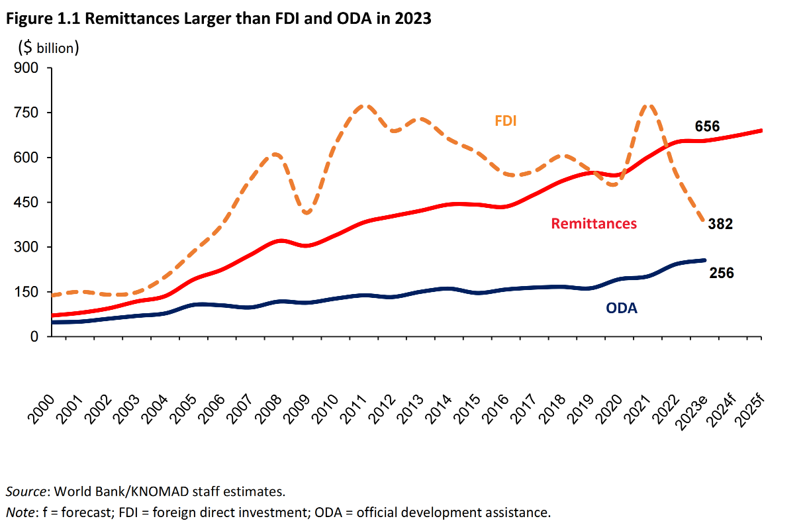
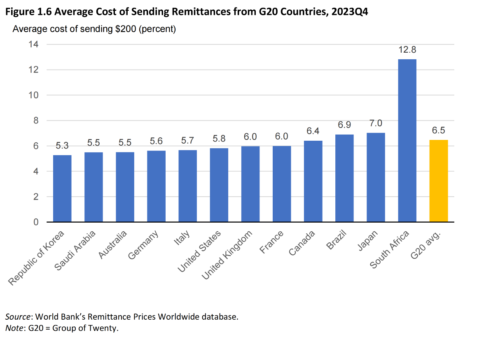
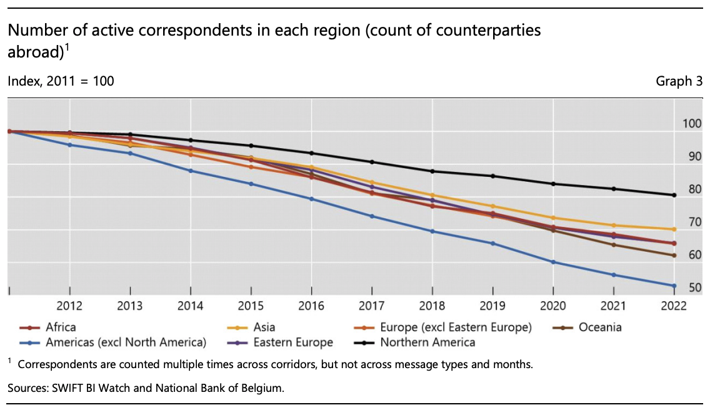
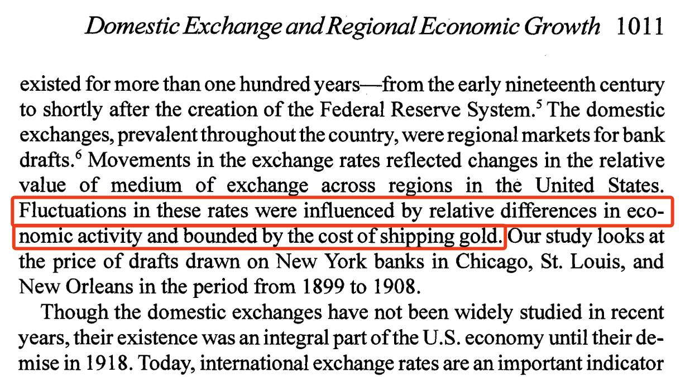

其实我对这个话题一直以来都很好奇，这些好奇的源头一部分来自于自己的生活上遇到的情况，比如在很多年前留学期间把人民币转出去成英镑需要填写的 SWIFT Code；在最近的从 Kraken 到 OCBC 过程中填写的各种内容；当然还有行业中本身遇到的各种概念，各种解决方案。

仔细想来自己从来对这方面的事情都了解的非常非常有限，以至于相信很多人和我一样，SWIFT Code 和 IBAN 两个有什么区别其实并不知道，所谓的清算行，实时结算系统，VISA 和 SWIFT 的关系等等都稀里糊涂的。

你要是说完全不懂吧，也不对，但是你要是让我跟别人解释解释吧，又说不明白。

当然，这其中最重要的原因还是我自己现在在做的项目也是稳定币相关的 BitU，虽然没有大到和考虑国际汇款或者是实际生活中的支付场景，但是总归是同一类的内容，了解了解总是无害。

对了，BitU 项目的推特和官网在这里，有兴趣可以了解了解。目前两千多万美元的 TVL。

- https://x.com/BitU_Protocol

- https://www.bitu.io/

## 碎片化的金融

一个众所周知的事实是，人类社会也是从个体到部落的聚集，然后再向更大的区域生活聚集，金融市场也是一样。即使是在一个国家之内，金融的开始也是碎片化的，随着社会和经济活动的增多，不同区域之间的交互增加，金融活动也随之增加，对能够相互通信的金融基础设施也自然而然地增加。

<!-- truncate -->

在 Crypto 也是一样，一个比较简单的例子是在单链系统中，我们其实不太需要能够帮助协议之间交互的基础设施。因为单链内部的许多协议开发标准是统一的，不同协议之间的交流沟通也是顺畅的。而当多链/生态出现之后，才开始有了跨链协议的需求。而我们看到一开始最多的跨链协议，支持的也都是同质化的生态，比如都是 EVM 兼容的，对于异构链，比如 ETH 到 SOL 的跨链支持则是比较靠后出现。

金融市场出现源自于经济活动的区域化，使得金融市场一开始也是区域化的。而不同区域的金融市场则就是碎片化的来源。许多相对底层的金融服务/协议则就是在解决这个碎片化的问题。

而又由于真实世界的情况过于复杂，使得这个碎片化的问题解决起来尤其复杂繁琐。

再回到 Crypto 市场，为什么 Crypto 市场的金融协议出现的时候受到了如此巨大的欢迎？其中一个非常重要的原因就是市场看到了一个可能性，一个可以构建一个全世界统一市场的可能性。

这个全世界统一的金融市场拥有相同，并且非常简单的通信标准，金融的碎片化可以非常轻易的打破。自由的逻辑设计可以实现许多现实世界需要花费巨大成本和精力才能完成的事情。

这个金融市场可以实现自动清算，实时结算等非常核心的功能，并且集账本、货币、证券核心要素于一身。

到后面再结合现实生活的例子，我们能够发现相较于传统金融的基础，这个统一市场有着多么大的潜在优势。当然，它的发展也因此存在着多么大的阻碍。

SWIFT
我相信大部分人应该都听说过这个名字，全称就不写了。SWIFT 应该是全世界范围内最大的国际金融基础设施（之一）。本质上 SWIFT 就是一个通信协议，说白了就是加入 SWIFT 协会的会员之间需要沟通，需要遵守的一套沟通准则。

加入 SWIFT 的会员都是来自全世界各地的金融机构，其中以银行居多。那么这么多机构之间该如何沟通呢？特别是业务上的沟通通过什么方式来进行呢？

你可能想到的是，打电话啊！

还真是没错。在 SWIFT 开始出现之前，跨地区的银行之间沟通的最主要方式就是电报！但是电报有很大的问题，最大的问题就是，打电报的人按照什么标准打？写错了咋办？

- 广坤要给赵四转 100 块钱。

- 广坤转赵四 100 人民币。

- 坤给四 100.

- 人民币 100，坤 --> 四

比如上面的四种方式，你可能看完都能明白什么意思，但是如果银行转账也是用类似的方式，那是不是也太不靠谱了，更别说打错字的情况了。银行收到这样的电报也会很奇怪，这是四个，如果是四千条，四万条呢？

所以 Telex 的核心问题是：

- 速度慢，安全性有问题

- 核心原因是缺少一个统一的信息传递规则

所以在这样的一个背景下，当然也是因为因特网的出现和发展，SWIFT 横空出世，发展到今天已经是规模最大的金融机构通信方式了。

你如果还是不理解，你就想想，现在全世界手机上的 Emoji 表情是不是都基本统一十分类似了。只不过 Emoji 是所有人都可以使用的东西，比如你发一个 😄，看到的人能够理解是开心，通用。但是在 Emoji 出现之前，你可能表达的方式是“我很开心”，又或者是用 “:)”。 这个就是标准统一的好处，简单清晰。

回过头来说，SWIFT 本质上只是一个信息传递的协议，它并实际转钱。只不过是当你从一个银行转钱到另一个国家的银行的时候，这两个不同国家的银行会用 SWIFT 来交流，帮助你实现转钱这个事情。

当然，为此 SWIFT 也开发了一套属于自己的 ”Emoji“，这样所有加入协会的成员都必须遵守，这样所有成员机构的任意消息，在任意成员内也都能够看明白。

这时候你可能会想，那既然是这样，是不是说银行之间的通信都用的是 SWIFT？你如果从你的工商银行账户转钱到农业银行账户，他们之间沟通会用 SWIFT 吗？答案是，可以，但没有必要。

因为 SWIFT 的服务是要收费的，加入 SWIFT 需要缴入会费，每年要交年费，此外，还会根据每条消息的类型和长度收消息的费用。所以同一个地区的银行，一般不会用 SWIFT 来沟通。一般来说每个区域也都会有属于自己版本的内部型 ”SWIFT“。

一个国家一般来说都会有中央银行，而其他商业银行都要听央行的，所以央行搞一套内部的系统，强制大家使用就可以了。但是国际上没有”世界政府“这种概念，世界银行也不能够强制所有的银行使用同一套标准。

多说一句，全世界看到了有这么一套统一标准的好处之后就在想，我们能不能再进一步统一！不要让 SWIFT 的标准止步于此，我们干脆来一个全世界都统一的金融市场标准好了！

你还别说，这东西还真开始出现了，IOS 20022 - A single standardisation approach (methodology, process, repository) to be used by all financial standards initiatives.

一个适用于金融行业各个方面的统一标准和准则。有兴趣的朋友可以去看这个 SWIFT 出的 IOS20022 简单版本。

https://www.swift.com/campaign/iso-20022/iso-20022-dummies

不光是银行相关的机构，未来会有更多的机构都会采纳这一标准。当然，这个标准也是也是由相关行业的领头组织提供准备的，经过大家的 Reveiw 之后，最终形成标准，然后推广。

## SWIFT 为什么贵？

在此之前，我们先来看看国际汇款的规模。根据世界银行《Migration and Development Brief 40》的报告，2023 年中低收入国家的国际汇款（流入）规模为达到了 $656 billion，其中前五名为：印度，墨西哥，中国，菲律宾以及巴基斯坦。而国际汇款的流出国第一名则是美国，之后是沙特阿拉伯。

国际汇款流入国家的规模已经连续几年超过了国外直接投资或者是援助支持。

说完规模，再来说说成本。

同样的报告，在去年第四季度，平均下来 200 美元的汇款成本要花接近 13 美元，也就是 6.4% 的成本，比去年（6.2%）还要高一些。

这个成本是数字汇款和非数字汇款的平均成本，如果是数字汇款的话，要便宜一些，成本为 4.9%；而非数字汇款（占比例差不多是 70%）的成本则更高：7%。

不同国家来看，G20 里面（这 20 个国际也是主要的国际汇款相关国家），韩国的汇款成本最低，南非最高。

国际汇款的成本如此高昂的核心原因在于两个：

- 缺乏竞争 --- 只能用 SWIFT

- 不同国家/地区之间的协作成本

很多人可能都知道 SWIFT 是如何工作的，如果你有一笔钱，想从招商银行打到你在美国的花旗银行账号下，那么你就需要从招商银行发起汇款申请。

收到这个申请之后，招商银行会看你有没有那么多钱，有的话把钱扣掉，然后通过 SWIFT 给美国的花旗银行发个标准化消息。

请注意，这个消息就是我们之前提到的需要标准化的地方！

一开始 SWIFT 给标准化了一下，然后很多银行都用了这个标准。前面提到的 IOS 20022 是这个标准的升级版本。

其实速度慢倒不是 SWIFT 导致的，你想啊，发条信息能有多慢？慢的是银行接收到信息之后得处理，另外，还得是在工作时间处理，周末或者下班了人就不处理了。

话说回来，花旗银行收到这个消息之后，会给你在美国的账户上给钱加上。

这样你的一笔跨国转账就算完成了。至于招商银行和花旗银行两家钱到底是怎么结算的，这个就不需要用户了解了，人家定期结算，保证流动性没问题。

这个是比较简单的情况，招商银行和花旗银行都很大，所以大概率相互是有联系有账户的。这样这两家的用户用起来就比较方便。但是你如果是一个非常小国家的银行呢？你不可能让小国家的银行在其他国家都开户吧。

所以针对这种情况，SWIFT 则是通过中间行来进行，说白了就是中间人。

A 银行要转到 B 银行，A 和 B 没有什么直接关系，A 就找到一个两个都有关系的中间人 C 来帮忙传递消息。

那如果没有这个 C 呢？那就再找呗。

就跟那个[六度分隔理论](https://en.wikipedia.org/wiki/Six_degrees_of_separation) 理论一样：世界上任何互不相识的两人，只需要很少的中间人就能够建立起联系。

但是找人帮忙是要有规矩的啊

这样雁过拔毛，成本不就上来了吗。

普通用户的需求/订单，到了这些大机构手上的时候，那不就是案板上的肉吗？

## 成本并没有会降低的迹象

国际汇款高成本，低效率（时间慢）本质上是整个交易链路上的银行都要核对确认好，并且收钱。

那有一个非常简单的道理，如果这个链路上的银行数量增加，相互之间有竞争，成本自然而然就会降低一些。我们能看到这个趋势吗？

很遗憾，并没有。

上面提到的中间行是非常重要的环节，中间行的数量越多，则能够反映出更加均衡的发展，更多不那么发达的地区，能够实现跨境汇款的需求，或者提供更加低廉的服务。但是还是根据国际清算银行发布的数据来看，中间行的数量其实是在不断减少。

特别是越不发达的地区，减少的越少。说白了就是穷地方的银行不干了，或者说大银行把穷地方的银行分部给关闭了，原因肯定是不赚钱。

这会到这这些地方的金融基础设施变得更差，金融服务变得更贵。

所以这个世界是在变得更好吗？起码跨境汇款的世界没有。

## 全世界统一的金融市场

现在我们再回头看看在一开始所说的全世界统一的金融市场，是一个多么牛逼且伟大的事情。

当然，以我的微薄的了解，显然是不足以讨论所谓全世界统一金融市场这个话题的。这里面涉及到的内容非常之多。

但是我们不要考虑那么多，单纯从业务逻辑上去考虑，我转一百块钱，用 SWIFT 经过 10 家机构，每家都给我扣一点，我不难受吗？

这有点像是你去景区玩，收你一次门票费，然后再收你一次环保费（用非常复杂巧妙的语言告诉你这笔钱会用来用多么高的科技保护环境，进景区之后不能走路必须坐车，再交一次费用，说这个车有多牛逼多环保不会对环境造成一点伤害等等等等。

说白了就是，让你付出代价的而获得的服务，你到底是相信这些代价是因为其技术真的有多么高深，多么不可触碰，还是因为因为想让你付出代价而故意巧立名目精心设计出来的冠冕堂皇的说辞。

再进一步就是，你内心觉得这个世界是草台班子吗？

很多时候你把别人激怒不是因为别人气愤你不懂瞎说，而是你触碰到了别人的利益。

## 其他类似于 SWIFT 的协议

除了 SWIFT 以外，还有很多区域性的通信协议也可以支持转账服务。比如之前提的例子，你从国内的某个银行转账到另外一个银行走的肯定不是 SWIFT 协议，但是他们依然可以通信。对这部分有兴趣的朋友可以去看这个。国际清算组织把全世界主要国家的支付/清算/结算体系都编辑成册了。

https://www.bis.org/cpmi/paysysinfo.htm

而一般一个国家的支付/清算体系又会分成几类，比如 Real-Time Gross Settlement 实时清算体系，又或者是净额清算。一个是实时发生的，一个是一天结束之后再来算账。

大部分稍微发达一点的地区都有自己的实时清算体系，能够让我们转账之后几秒钟后，让对方收到。

全世界第一个这样的实时清算系统来自于美国的 Fedwire。

在美国的 Fedwire 出现之前，美国的中央银行系统是由 12 个联邦储备银行构成的。而不同联邦储备银行管辖的区域，经济发展水平不同，利率也不同。此外，造成利率不同的还有一个因素，是运送金子的成本（是的，你没有看错，是运送金子的成本）。

刚刚一开始，美联储开发给各个联邦储备银行用的软件其实有非常大的问题。当然，美联储也不是故意这样的，恰恰相反，美联储在一开始希望这个大家一起使用的软件能够满足大家的需求，所以基于这十二个储备银行基于自己的实际业务情况去提需求，然后美联储给集合起来，搞个打包的升级版本。

但是很遗憾，这样的一个软件反而不太行。

“With 12 organizations working independently to improve their local service, a system acrose that as a whole did not fully meet the needs of emerging regional and national banks.“

后来，美联储又对软件/网络做了升级和修改，最终反应过来了：与其尝试去满足这些不同区域使用者的需求，不如我干脆做一个简单的资金/证券支付转移的系统！然后再经过演进更新，就慢慢地成为了现在的系统。

这个详细描述了 Fedwire 的发展过程，有兴趣可以去看看。

https://www.newyorkfed.org/medialibrary/media/research/epr/97v03n2/9707gilb.pdf

欧洲则是在 1999 年的时候，European Monetary Institute 和欧洲各国央行一起搞的一个 TARGET（Trans-European Auto Real-Time Gross Settlement Express Transfer）。欧洲各国的银行结算欧元的时候会方便很多。

在 Crypto 领域，比较知名的当然是 Ripple。对了 Ripple 也会向 IOS 20022 靠拢，遵守相关的标准和准则。

Swift 的垄断地位在于其庞大机构成员数量，而银行作为一个非常传统的金融组织，很多内容其实都是基于旧的基础设施之上。这些老旧的系统维护成本很高，更改升级的成本更高。特别是当经济活动发展之后，为了满足新的支付需求和场景，老旧系统需要付出的成本更高。而这些成本自然而然地都会转嫁到最终用户身上。

## 最后

零零散散说了这么多，希望耐心读完的朋友没有觉得浪费时间。SWIFT 作为最底层的全世界金融机构通信协议，在此之上又有区域性的通信协议，还有三方支付平台，比如支付宝/Paypal。当然，还有一个极其庞大的卡组织机构。

支付领域内的内容实在太多，希望以后有机会继续把自己的算是笔记吧，分享给大家。目前还没有太多关于 Crypto 支付应用的内容，后面希望能够补上。

一个系统的发展升级和改造通常都是缓慢的，为了适应发展，通常要付出越来越高的改造成本。与发展的缓慢不同，旧系统的毁灭通常是在一瞬间完成的。

我们可以想象在 SWIFT 出现之前，经济越来越发展，跨境汇款的需求越来越高。当时的银行对于电报机的需求量肯定是增加的，在电报机厂商拿到订单的同时，他们可能很开心。但是在几年之后，却又全部遭到了毁灭。