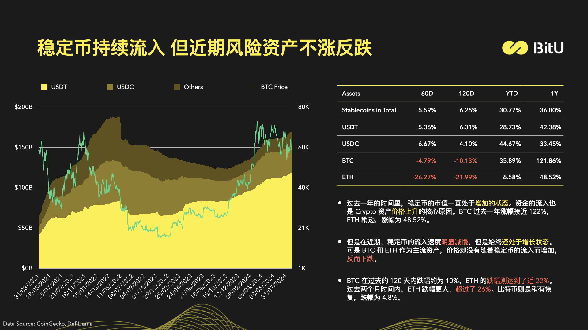
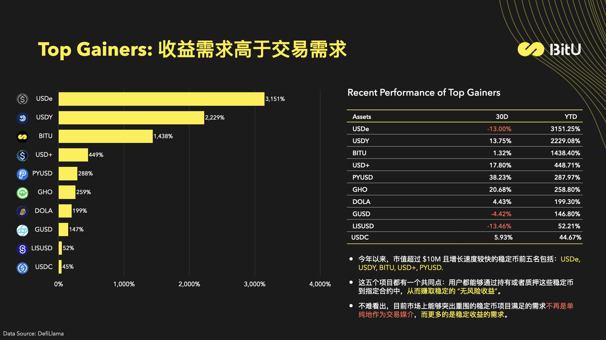
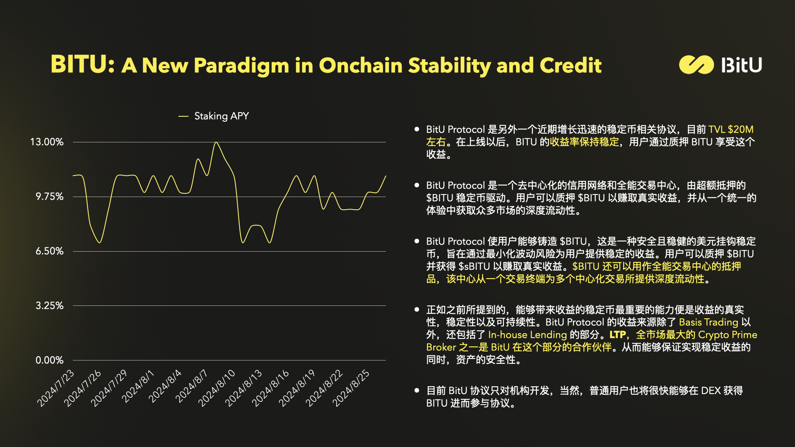
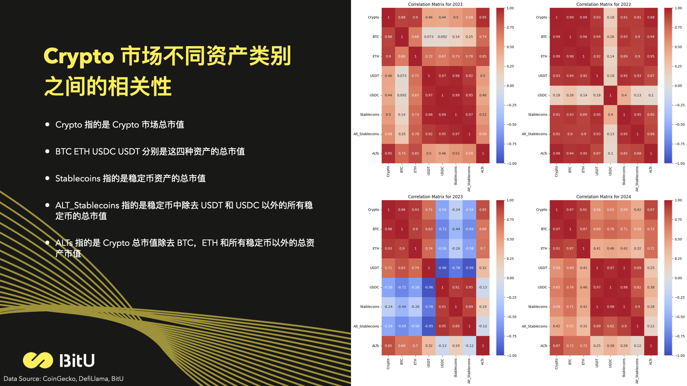

这是一个 2024 年 9 月初写的稳定币报告，主要就是看一下稳定币的市场情况。同时，还有稳定币与不同的资产类别之间的相关性。

- 稳定币的市场规模
- 稳定不不同的类型
- 稳定币的市值变化与市场份额
- Top Gainers 和 Top Losers
- 稳定币与比特币，以及其他不同类别资产之间的相关性
- ...
<!-- truncate -->

### 报告下载链接
- 中文: https://docsend.com/v/g63d5/stablecoin_overview_sept2024_cn
- 英文: https://docsend.com/v/g63d5/stablecoin_overview_sept2024_en

这里放几张报告的图片，完整版可以下载 PDF 之后查看。

