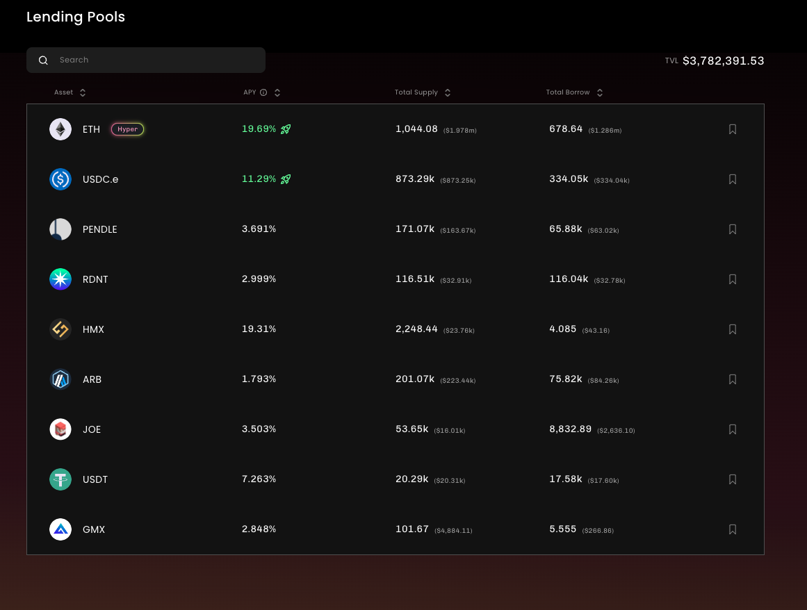

## Stella ARB 短期激励上线 20% APY

Stella 是之前的杠杆挖矿项目 Alpha Finance，改名字了。单纯的杠杆挖矿，加最高的杠杆，再加上 ARB 的激励，APR 能超过 500%。但是这种操作还是太冒险了，毕竟是组 LP 在，还是加杠杆，无常损失会很夸张。

除了这个刚刚挖矿以外，还有 ETH 的借贷池子可以享用，收益相对来说也不错，能有接近 20%。这个活动好像是持续一个月，一个相对比较老牌的项目，风险各方面应该还好。我自己打算试一下。

这项目其实挺神奇的，一开始就是以杠杆挖矿出名，是 Bn Launchpad 上的项目，上线之后到 DeFi Summer 涨了超过 100 倍。然后在后来项目又被盗了。后面团队可能觉得光是搞这个 DeFi 没什么头绪了，就把项目改名了，改成了 Alpha Venture Dao，搞孵化了。你还真别说，一开始的几个项目在那个时候都还是挺好的，比如说有 Binance Launchpad 项目 Beta Finance，pStake，GuildFi 等，注意啊 我说的是那个时候还挺好的，但是现在都非常不怎么样。

现在项目可能又觉得搞孵化搞不起来了，又回去重新搞杠杆挖矿了。并且改名叫做 Stella。大概就是这么个故事。