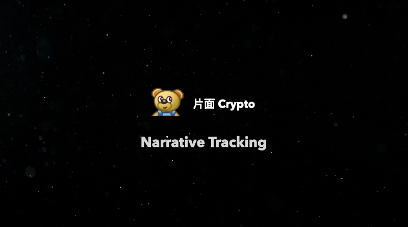
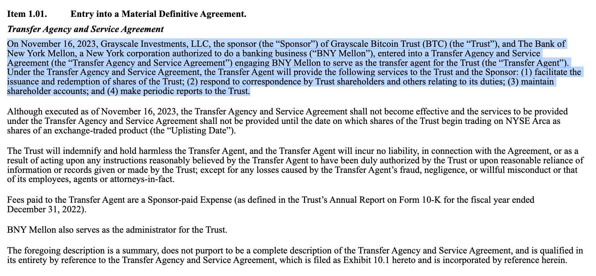

## CZ 辞职，Richard Teng 接任 Binance CEO

这个事情大家应该都有看到新闻了，总结就是 Binance 认罚，CZ 辞职，并且 3 年内不允许参与 Binance 的工作，股份保留。其他的就是罚款和判决，罚款四十多亿美金，判决还没有下来。

本来第一条传出来的新闻是美国监管机构和 Binance 和解，BNB 应声大涨，最高超过 271 usd，随后快速下跌，目前报价 230 美元左右。

这个是 BN 和 OFAC 的和解书，里面写的很清楚主要是给美国用户以及被制裁的地区用户提供服务，并且在知道这么做违反美国的法律之后，还继续进行。
- https://ofac.treasury.gov/system/files/2023-11/20231121_binance_settlement.pdf
- https://ofac.treasury.gov/system/files/2023-11/20231121_binance.pdf

不过比较离谱的是，这个里面竟然有非常非常详细的交易笔数，比如，一共给伊朗用户提供了 1,205,784 次交易服务，朝鲜 80 次。

另外一个和 FinCEN（财政部的一个部门）详细的文档说明在这里
- https://www.fincen.gov/sites/default/files/enforcement_action/2023-11-21/FinCEN_Consent_Order_2023-04_FINAL508.pdf

里面有不少关于 Binance 的交易数据，比如说，2019 年 VIP 客户的交易量和营收占比在 2/3 到 3/4 之间。美国的 VIP 用户，贡献的交易手续费在 15%-20% 之间，2020 年 10 月分，一个美国 VIP 用户就占据了整个平台 12% 的交易量份额。

这几个文件里面都有不少有趣的东西，有时间的可以看看。

## Grayscale 和 SEC 的有关部门开会，其他比特币 ETF 发行人也与 SEC 碰面

https://twitter.com/JSeyff/status/1727107454738272370

此外，Grayscale 还提前与纽约梅隆银行合作准备未来 ETF 上线之后的发行和赎回等工作。

## 美国财政部长耶伦（威胁）Sent a message to the virtual currency industry 

视频看起来确实是有点像是威胁，就是电视里看到的那种：I am sending *** a last message... balabala 之类

https://twitter.com/BanklessHQ/status/1727074910370214051