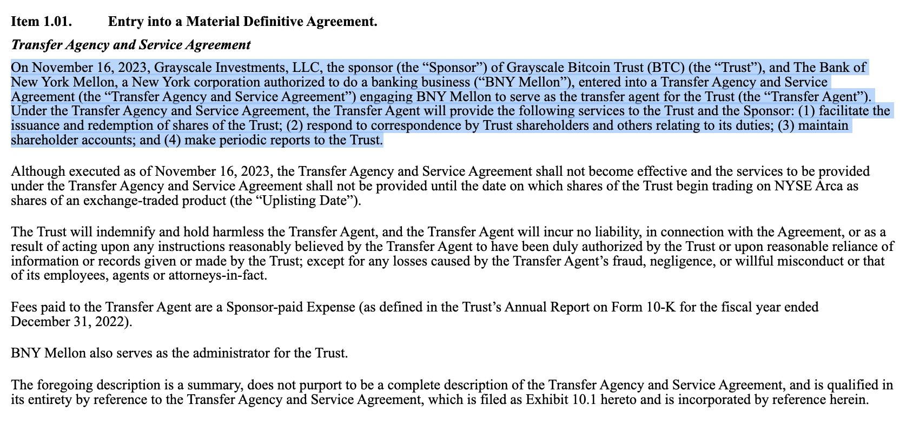
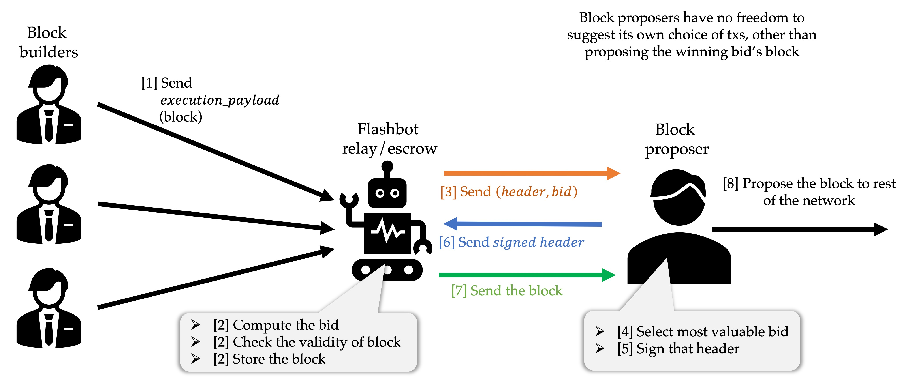

## CZ 辞职，Richard Teng 接任 Binance CEO

这个事情大家应该都有看到新闻了，总结就是 Binance 认罚，CZ 辞职，并且 3 年内不允许参与 Binance 的工作，股份保留。其他的就是罚款和判决，罚款四十多亿美金，判决还没有下来。

本来第一条传出来的新闻是美国监管机构和 Binance 和解，BNB 应声大涨，最高超过 271 usd，随后快速下跌，目前报价 230 美元左右。

这个是 BN 和 OFAC 的和解书，里面写的很清楚主要是给美国用户以及被制裁的地区用户提供服务，并且在知道这么做违反美国的法律之后，还继续进行。
- https://ofac.treasury.gov/system/files/2023-11/20231121_binance_settlement.pdf
- https://ofac.treasury.gov/system/files/2023-11/20231121_binance.pdf

不过比较离谱的是，这个里面竟然有非常非常详细的交易笔数，比如，一共给伊朗用户提供了 1,205,784 次交易服务，朝鲜 80 次。

另外一个和 FinCEN（财政部的一个部门）详细的文档说明在这里
- https://www.fincen.gov/sites/default/files/enforcement_action/2023-11-21/FinCEN_Consent_Order_2023-04_FINAL508.pdf

里面有不少关于 Binance 的交易数据，比如说，2019 年 VIP 客户的交易量和营收占比在 2/3 到 3/4 之间。美国的 VIP 用户，贡献的交易手续费在 15%-20% 之间，2020 年 10 月分，一个美国 VIP 用户就占据了整个平台 12% 的交易量份额。

这几个文件里面都有不少有趣的东西，有时间的可以看看。

另外 CZ 在法庭上说的话，读起来挺有意思的

https://twitter.com/BitMEXResearch/status/1727110917999980757

能看出来他讲实话可能是有点害怕的，然后就是认了，就想赶紧把这个事情解决，也没想着要打官司反抗。

## Grayscale 和 SEC 的有关部门开会，其他比特币 ETF 发行人也与 SEC 碰面

https://twitter.com/JSeyff/status/1727107454738272370

此外，Grayscale 还提前与纽约梅隆银行合作准备未来 ETF 上线之后的发行和赎回等工作。

## 美国财政部长耶伦（威胁）Sent a message to the virtual currency industry 

视频看起来确实是有点像是威胁，就是电视里看到的那种：I am sending *** a last message... balabala 之类

https://twitter.com/BanklessHQ/status/1727074910370214051

## dYdX 提出新的关于针对解决/缓解 MEV 问题的框架

https://dydx.exchange/blog/architecture-to-mitigate-mev

MEV 会导致交易被审查，也就是有些交易会被人为控制被包含在区块中，有些不会，这是不好的。不公平了。

大概的解决办法就是，在区块被产生之前，交易先被排序，然后区块生产的人去竞拍选择一个区块，这样在选择区块的时候并不能选择里面的交易，这样就能够缓解了。这个和 MEV-Boost 的方法是差不多的，就是 Block builder 和 Block proposer 分开工作，中间让 Flashbot relay 来传递信息。

对这个有兴趣的可以看看这个链接：https://hackmd.io/@layr/SkBRqvdC5

## SEC 又开始搞 Kraken 了

https://blog.kraken.com/news/kraken-continues-to-fight-for-its-mission-and-crypto-innovation-in-the-united-states

SEC 说 Kraken 是一个未经注册的交易所，Broker，Clearing house。还是美国本土公司好，直接说：我们不同意。

## Stride 给 DYDX holders 发空投

https://twitter.com/stride_zone/status/1726956525242155103

## Genesis 起诉 Gimini 要追回之前牺牲其他债权人转走的超过 6.89 亿美元

https://www.coindesk.com/policy/2023/11/22/genesis-sues-gemini-to-recover-preferential-transfers-worth-689m/

## Bittrex 宣布停止运营

https://twitter.com/BittrexGlobal/status/1726652430673121310

## Circle 发布了一个 USDC 桥接的标准

https://www.circle.com/blog/bridged-usdc-standard

之前都是第三方自己做的，不同的第三方做的可能不一致。现在除了 Circle 自己发的 Native USDC，还给第三方提供了一个标准的桥接方式

## Privy 融资 1800 万美元，Paradigm 领

https://www.privy.io/blog/series-a-announcement

这个项目是一个怎么说呢，用户登陆插件，原画是 Bring your users onchain。挺有意思的一个产品，你可以直接把用户登陆板块用他们的产品，提供传统的登陆方式，还有 Crypto 的登陆方式。这里有一个 demo 可以试试 https://demo.privy.io/

## Beta Finance v2 借贷市场上线

https://twitter.com/beta_finance

