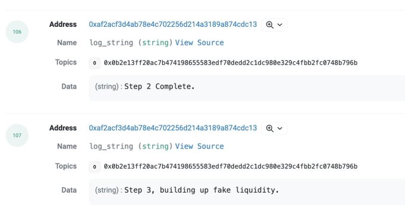
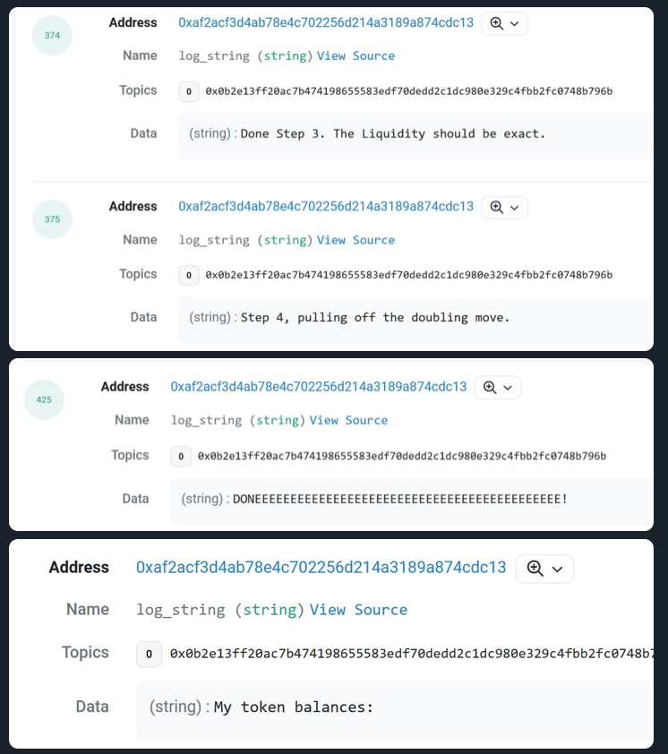

## Blast is unstopped!

https://twitter.com/Blast_L2/status/1727475453869301854

Blast，blur 创始人新做的 Layer2，三天内的 TVL 已经达到 2.4 亿美元！！！太夸张了，现在的逻辑很简单，Blast 把 ETH 拿去存到 Lido 里，然后赚取利息。玩法方面用户可以组队。

我当然是也参与了，如果你想加入小队，可以用下面的链接：

- blast.io/BWNYS
- blast.io/MBPDA
- blast.io/7XQ7G
- blast.io/LAX0G
- blast.io/493CI
- blast.io/N2UEI

现在只能存不能取，要等到明年 2 月份才可以。现在能够获得积分，然后在主网上线的时候发空投。

Blast 的想法其实很有意思，本质上是把 Blast 上的 Native ETH 变成 stETH，这样其他所有的协议都是基于 stETH 而不是 ETH。比如 Uniswap 的交易对完全可以使用 stETH-ABC，通过这种方式能够大大地增加 ETH 的使用效率。并且本身 stETH 还能够生息，使得整个协议更加赚钱。

但是这样的方式风险肯定也存在
- 第一个肯定就是给 ETH 带来的中心化风险
- 第二个是用户跨链不是 ETH 了，这样对用户来说可能不友好，而且毕竟持有 ETH 的人大大多于 stETH 的人
- 然后就是 stETH 的风险，比如脱锚，之前也发生过
- 最后就是 stETH 毕竟还是质押着的，有收益的同时也有风险，节点的 slash 风险是最大的之一，当然，这个虽然有出现的概率，但是收益从长期来看是能够覆盖掉
- 最后，这种方式还算是 Layer2 吗？
- 带收益的稳定币也是一个样子，核心内容其实就是，带入收益的同时也一定会带入风险，而且把资产作为底层来说，风险也是会层层叠加到生态中的协议里去的。如果稳定币的收益下降了呢？或者有更严重的问题出现了呢？
- V 神之前说过，不要给 ETH 的共识超载，本质上就是不要让以太坊承载本身不属于它管理的内容，比如说 social risk，以太坊作为一个底层的信任基础，稳定性和鲁棒性以及独立性是最为重要的，否则一切在上面建立的价值都将不复存在。

## Kyber 被攻击 损失超过 4000 万美元

https://twitter.com/spreekaway/status/1727462694138024249

最牛的是，黑客还一步一步地讲解 Ta 是如何进行的，每一笔交易都有解释。

## BlackRock 和 Grayscale 都与 SEC 近期沟通了 ETH 的事情

https://www.theblock.co/post/264162/sec-just-met-with-grayscale-for-spot-bitcoin-etf-listing-memo-shows

## Heco 被盗 1 亿美元

https://www.coindesk.com/tech/2023/11/22/justin-sun-confirms-htx-heco-chain-exploited-after-100m-in-suspicious-transfers/

安全公司说这次被盗是因为私钥泄露，如果是这种原因，那很有可能就是内部人员做的（毫无根据的个人猜测）。

## Arware（AR） 交易数据持续增高

https://twitter.com/warcin101/status/1727363875451080985

## 射击游戏 Natr1x Fire 融资 1000 万美元

https://decrypt.co/207166/matr1x-fire-raises-10-million-for-next-nft-mobile-shooter

## Silvergate 还清了债务

https://www.reuters.com/business/finance/silvergate-capital-fully-repays-deposit-liabilities-2023-11-22/

## 扯淡！NETFLIX 的一个导演挪用 400 万美元资金去投资了 DOGE

https://www.cryptopolitan.com/netflix-director-bets-4m-movie-funds-on-doge/

还 tm 的赚了 2700 万美元！拍电影呢？还拍啥电影啊！