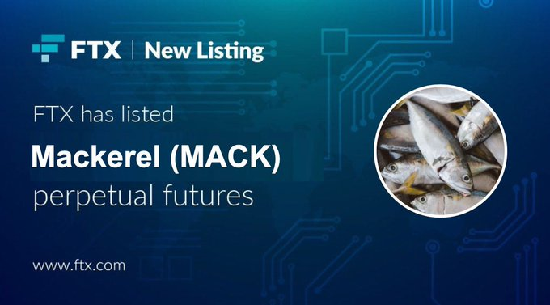

## Made my day

## Binance 上线 BLUR 现货交易

https://www.binance.com/en/support/announcement/binance-will-list-blur-blur-with-seed-tag-applied-85306854c60347a6a4131493ec8d26a6

下一个会是 PYTH！LONG $PYTH！🚀

## Kyberswap 的攻击分析

https://twitter.com/0xdoug/status/1727613541115429314

非常技术，没有完全看懂，但是作者说这个是截止到目前为止最复杂，最精心设计的攻击。

## Blast 的智能合约由 3/5 多签控制

https://twitter.com/jarrodWattsDev/status/1727584394796323042

Polygon 的工程师 Jarrod Watts 写了一个关于 Blast 合约的分析，结论是目前为止 Blast 的智能合约只有两个事情，一个是接受来自用户的存款，第二个是把用户的钱再存到其他的合约。

除此之外，Blast 没有测试网，没有桥，没有 rollup 什么东西都没有。所有用户的 eth 目前全部都在 blast 的智能合约里面，并且由一个多签钱包控制，这个钱包的控制地址都是新地址，所以并没有人知道这些人到底是谁。

## 新一版（第三版）的 Matering Bitcoin 已经发布了

https://dtrt.org/posts/mb3e-announcement/

## 比特币转账历史上最高手续费 310 万美元

https://www.coindesk.com/business/2023/11/23/bitcoin-sender-struck-with-31m-transaction-fee-largest-in-history/

有人为了一笔 6.25 个比特币的转账支付了超过 85 个比特币，价值超过 310 万美元的费用。这笔交易手续费被蚂蚁矿池拿去了。在今年九月份的时候 Paxos 因为程序 Bug 也支付过一次夸张的手续费，19.8 个比特币，当时是给了 F2Pool，但是 F2Pool 给换回去了。

## FLIP Token 上线了

https://twitter.com/Chainflip/status/1727658495514943778

目前价格 4.8，从昨天上线以来已经涨了一倍多。Chainflip 是一个跨链交易所。Token 总量是浮动的，初始总量是 9000 万，对应的 FDV 差不多是 4.3 亿美元。

## COWswap 提出了对协议费用的升级提案

https://forum.cow.fi/t/cip-draft-testing-fee-models-for-cow-protocol/1984

总之就是如果实际执行通过的话，CoW 的协议收入会增加很多。