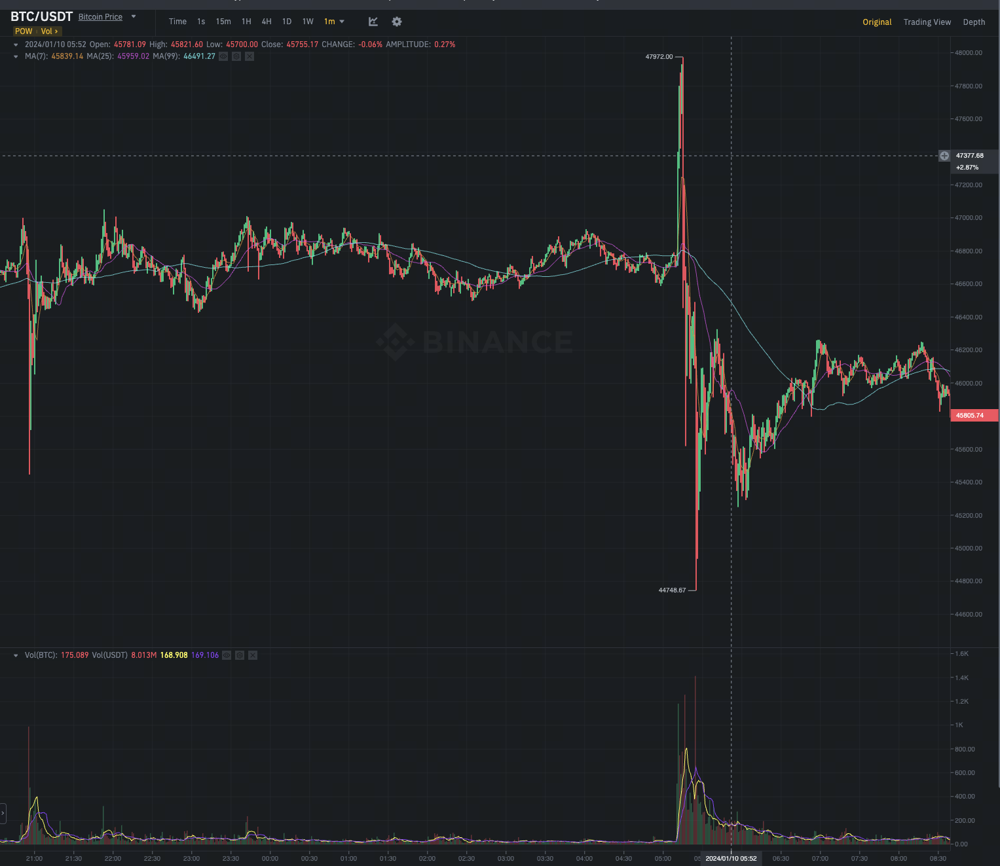
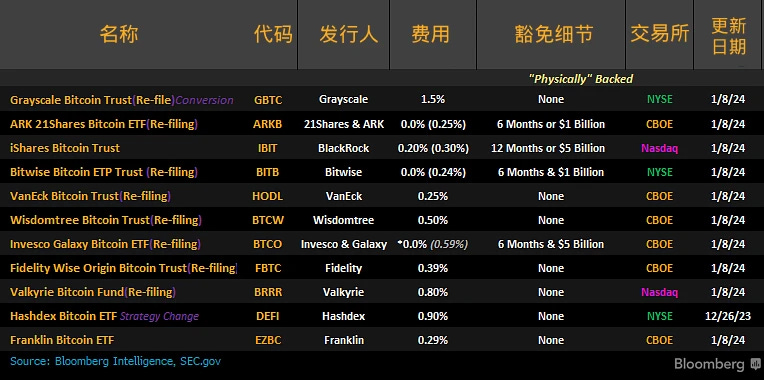

今天最离谱的事情就是 SEC 的推特（X）账号被盗了，发了一条假推特：
> "Today the SEC grants approval for #Bitcoin ETFs for listing on all registered national securities exchanges. The approved Bitcoin ETFs will be subject to ongoing surveillance and compliance measures to ensure continued investor protection."

随后很快，SEC 主席就发推解释说是账号被盗了，SEC 目前还没有批准比特币现货 ETF。比特币价格首先是冲到了四万八以上，然后跌倒了最低四万五。一上一下大几千万美金的合约就多空双爆了。

离谱。

## DOGE 假消息

另外一个同样离谱的事情是 DOGE 因为一条表情包背后的真实的狗已经死掉的推特大涨。但是随后，发推特的人又删除了推特，说是假新闻。

新闻最开始是一个 Dogecoin 和那只狗的家里人沟通的聊天记录。配文还说，一个去世的艺术家的作品要比活着的时候贵重 10 倍。

现在的比特币现货 ETF 总结：

Ondo Foundation 开启了 Point 激励，现在可以去领 https://ondo.foundation/points

ATOM 提案修改通胀的参数，最小值设置为 0 https://forum.cosmos.network/t/proposal-set-min-inflation-at-0/12224/1

WEMIX 宣布不会再有新的 Token mint https://www.wemix.com/communication/wemix,-zero-minting-2c58693a149d

AAVE 准备支持 PYUSD，PYUSD 就是 Paypal USD，是 Paxos 发行的。 https://snapshot.org/#/aave.eth/proposal/0x708310f654e502ed75ef4f9d8e3942af3702bc218b4946b9c5f8345070c04940

