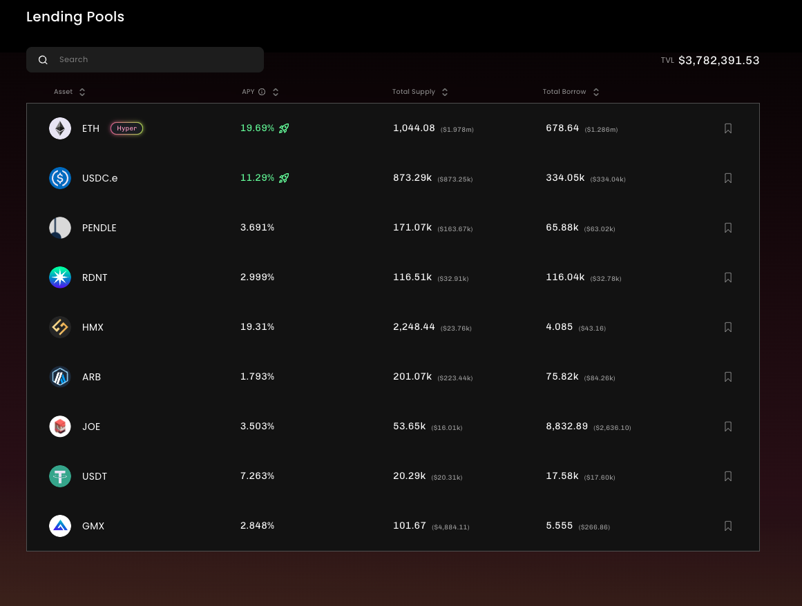

## Stella ARB 短期激励上线 20% APY

https://app.stellaxyz.io/lending

Stella 是之前的杠杆挖矿项目 Alpha Finance，改名字了。单纯的杠杆挖矿，加最高的杠杆，再加上 ARB 的激励，APR 能超过 500%。但是这种操作还是太冒险了，毕竟是组 LP 在，还是加杠杆，无常损失会很夸张。

除了这个刚刚挖矿以外，还有 ETH 的借贷池子可以享用，收益相对来说也不错，能有接近 20%。这个活动好像是持续一个月，一个相对比较老牌的项目，风险各方面应该还好。我自己打算试一下。

这项目其实挺神奇的，一开始就是以杠杆挖矿出名，是 Bn Launchpad 上的项目，上线之后到 DeFi Summer 涨了超过 100 倍。然后在后来项目又被盗了。后面团队可能觉得光是搞这个 DeFi 没什么头绪了，就把项目改名了，改成了 Alpha Venture Dao，搞孵化了。你还真别说，一开始的几个项目在那个时候都还是挺好的，比如说有 Binance Launchpad 项目 Beta Finance，pStake，GuildFi 等，注意啊 我说的是那个时候还挺好的，但是现在都非常不怎么样。

现在项目可能又觉得搞孵化搞不起来了，又回去重新搞杠杆挖矿了。并且改名叫做 Stella。大概就是这么个故事。

## Perennial ARB 交易奖励

https://medium.com/perennial-protocol/introducing-arb-rewards-on-perennial-7cdc5a85c601

和上面一样，Perennial 也有 ARB 奖励，奖励具体给到交易用户和使用 Earn 的用户，每周六万多个 ARB 分配给用户

## Arbitrum 社区通过了 Staking 投票

https://snapshot.org/#/arbitrumfoundation.eth/proposal/0xf22530295daee96dffd7f70854475c06216a4d3594929672f71c12bf638bb0c8

目前的投票结果是放出来 1% 的币，也就是 1 亿个 ARB，在一年内分配给 Staking 的用户。官方也给出了大概的收益数据，具体取决于有多少比例流通的 ARB 被 Staking 进去。 如果是一半的流通量被质押，那么 APR 差不多是 15% 左右，只有 25% 质押的话，收益率会提高到 31%。 这样看收益还是很可观的，未来一年内夹杂着市场变好的话，ARB 还是 📈 的应该。

## Avalanche 裁员 12% 主要是 Marketing 团队的人

https://twitter.com/el33th4xor/status/1721684964389900415?s=20

## BTC MVRV 数据目前水平 1.5 上下

https://www.lookintobitcoin.com/charts/mvrv-zscore/

MVRV 越高说明泡沫越大，数字越低则说明越小。注意这个数据是动态变化的，分母是泡沫，分子是实际发生的价格，所以即使价格不变这个数据也还是有可能会缩小的。当然了，变小是好事。数字越小说明现阶段还没有说明泡沫，也就是还有上涨的空间。一般来说，这个数据如果超过 3 了就危险了。但是本轮按照目前的分子 RV 数据，如果这个数字到达 3.5 的水平，那差不多比特币的价格要超过 10 万了。

## Bitfinex Alpha 79 期

https://blog.bitfinex.com/wp-content/uploads/2023/11/Bitfinex-Alpha-79.pdf

- on-chain data
- 美国宏观数据
- Crypto 新闻（SBF 的审判；Paypal 的稳定币 PYUSD 增长迅速并开始被 SEC 调查；Ripple 和格鲁吉亚的央行合作尝试 CBDC）

## Kraken 打算也搞一个 Layer2

https://www.coindesk.com/tech/2023/11/07/kraken-said-to-seek-partner-to-help-build-it-a-layer-2-blockchain-network/

接着 Coinbase 的后续，Kraken 自己也想搞一个 Layer2 了，正在寻找合作伙伴，目前考虑的有 Polygon，zkSync 等。之前 Base 链搞得很成功，Coinbase 是和 OP 合作。现在 Kraken 考虑的都是 zk 系的，同时官网也放了一个这方面的职位空缺。

## Qredo 还能运营半年， 又裁员 50%

又一个要倒闭的公司，币价跌了基本归零，最高 10，现在 0.04. 要倒闭的公司是谁不重要，重要的是他们做的是什么业务。Qredo 一共融资接近一个亿美元，上一轮就融了八千万美元，而且还是在去年的 2 月份，一年半花了 8 千万美元。。。平均一个月平均一个月 400 万美元。。。离谱

Qredo 的具体业务包括：
- Layer 2 协议：Qredo Network
- 托管解决方案

## Defi Wars 感受到爱

https://twitter.com/defiwars_/status/1720421547154772270

Defi Wars 说两年了坚持不下去了要关闭了。但是知道这个消息之后很多人/项目跑过来支持，捐钱，现在又能继续坚持下去了。

Defi wars 主要就是一个数据网站，把各个竞争中的项目数据统计在一起，比如 LSD，Curve 等等。

## EigenLayer 开始投票支持新的 LST 

https://jokerace.xyz/contest/mainnet/0xec17AaBa6855461e0835A2113EFA942F01FD5B39

EigenLayer 以太坊 re-staking 协议，现在开放投票准备支持更多的 LST 币。当前项目只支持 rETH，stETH，cbETH 还有原生的 ETH。现在新开放 8 个项目，包括 Bn 的 eth，frax 的 eth， ankr 的 eth 等等。具体的投票情况和结果可以在这里查看 https://dune.com/sixdegree/eigenlayer-lst-addition-contest

## BN 上线 ORDI

Binance 上线了 Ordi，目前已经涨了超过 50%。想了解 BRC20， ORDI 比特币 ETH 可以看这个 https://pmcrypto.xyz/blog/what-is-brc20

## 新项目

### Dinero

https://dineroismoney.com/

ETH Staking + 稳定币 + On-Chain EVM。这个项目和昨天写的 Prisma 很类似。项目一共分成三个部分：
1. ETH staking --- pxETH（凭证但是没有收益，流动性凭证）
2. 稳定币 DINERO --- pxETH 抵押 mint 稳定币
3. 搭建自己的 RPC （Redacted relayer），用户可以用稳定币 DINERO 付 Gas。

前面两步和 Prisma 几乎一样的。第三个不知道未来是什么情况。这个项目是 https://twitter.com/redactedcartel 孵化的。