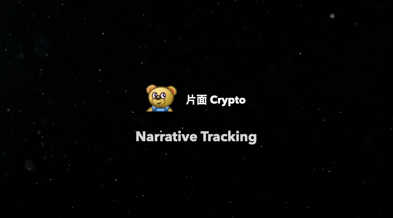

## Quasar 空投现在可以查询

https://twitter.com/QuasarFi/status/1721575410457030875

Quasar 是一个基于 IBC 的 Appchain，主要做的事情是资产管理。Quasar 里提供了多个可以去投资的池子，用户可以投资钱进去理财生息，具体的池子策略都稍有不同。如果之前有参与过的可以去看看自己有没有空投。

## Evmos 计划抛弃 Cosmos，专注于 EVM

https://www.theblock.co/post/261855/evmos-plans-to-deprecate-cosmos-transactions-signals-ethereum-alignment

专注于 EVM 意味着不再支持 Cosmos，希望能够给 EVM 基础的交易提供更好的体验。具体停止支持的时间预计在明年的三季度完成。同时支持两种格式的交易给开发带来了非常多的困扰，特别是钱包方面需要兼容两种规格的交易。

## marginfi，Solana 上的 Defi 项目发布了移动端的应用（不是 App）

https://twitter.com/marginfi/status/1721921391510057381

marginfi 自我标识是想做一个 Solana 上的综合性 DeFi 协议，目前项目支持借贷，交易，跨链桥等功能。但是目前只有借贷是自己做的，交易使用的 Solana 上的另外一个协议 Jupiter，跨链桥使用的是 Mayan 协议。

## JoyID 正式发布

https://twitter.com/joy_protocol/status/1721458975714263168

一个非常有意思的产品，基于 Webauthn 打造的钱包。至于这个具体是什么，简单来说就是利用你的硬件（电脑手机）来创建一个钱包，你通过唤醒你的设备来触发对钱包的控制权。唤醒设备的这个过程其实是你的硬件设备中的鉴权模块，比如说指纹识别来执行的，所以安全性由它来控制。

有兴趣的可以去体验一下，免费使用创建一个钱包，过程还是挺丝滑的。最近这个项目在做活动，参与可以领取 JPoints，虽然不知道未来有什么用。

下面这个链接是我的 referral 链接，你可以使用这个链接直接去创建钱包，当然你也可以直接去官网创建下载。

https://app.joy.id/?invitationCode=qQe8mX

## pimlico 融资 420 万美元，a16z 领投

https://twitter.com/pimlicoHQ/status/1721890681185321018

pimlico 是一个协助以太坊 4337 账户开发的套件，项目针对于其他开发者，特别是正在打算开发 4337 账户的开发者提供套件服务，能够帮助这些项目快速落地。

## Epoch Island ITO

https://twitter.com/EpochIsland/status/1721921887121674364

这是一个非常有意思甚至可以说是神奇的项目。首先这个项目并没有说自己具体是干什么的，只说了做的事情很大。具体分成 7 个步骤，分别是：治理，代币，管理员，融资，收入，土地和外交。

是不是云里雾里的，我看完也是，我很难形容总之就是说要公平要建设。重要的是，他们会开始做 ITO，你别管这个名字是什么，总之就是融资，但是好消息是，你投钱之后，随时可以取出来，而且这个时间很长，在这个过程中币价也是有市场价格的（根据介绍）。所以有兴趣的这种云山雾绕的项目可以关注一下。

另外，现在有一些活动可以免费白嫖一些币，发推特之类的。具体的介绍链接在这里：https://epochisland.io/time/ 填写完邮箱就可以参与了。

## Chorus One 发布了 Q3 季度报告

https://twitter.com/ChorusOne/status/1722157074304716805

内容涉及挺多的，主要包括 EVM，ETH Staking，NEAR 生态回顾，Interchain 的安全性等，我看了三分之一，剩下没看完。

## Binance 发布 Web3 钱包

https://twitter.com/binance/status/1722154485928317010

这个应该都看到了，但是我发现它非常傻逼，要 App 扫码才能进去，即使你网页登陆了也不行。然后我 App 就扫码，然后显示无效的二维码。极其**，直接给我劝退。

重复一遍：已经登录账号，还需要扫码才能登陆 Web3；这种设置要么是纯**要么是 Bug。其次，扫码识别不出来。

具体钱包还没有体验，希望好用吧！