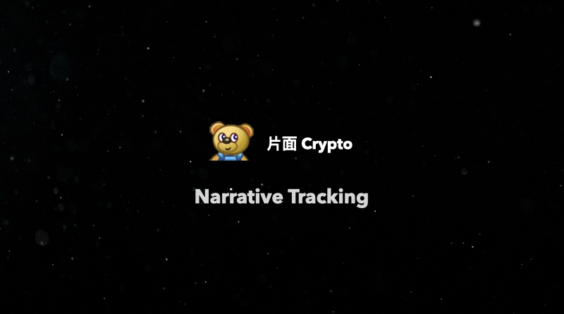

## 美国财政部与国税局关于数字货币经纪商的新法规

https://public-inspection.federalregister.gov/2024-30496.pdf

证券行业关于证券出售的三个核心功能/阶段
- 客户向经纪商发起出售证券的交易订单
- 经纪商将订单信息发送到交易中心，如 NYSE 等
- 订单在交易中心匹配到对手方之后，匹配到交易被发送到清算机构，清算机构会在两个代表客户的经纪商账户之间转移证券和资金，记录和结算交易

DeFi 的三层结构
- 界面层，用户界面
- 应用层，协议的逻辑
- 结算层，区块链/去中心化账本

交易前端会被纳入到经纪商的范围里面：交易前端服务提供商和证券经纪人都使客户能够查看一系列可能的交易选项，做出选择并确认该选择，并传达客户希望进行的交易的详细信息，以便其他市场参与者可以执行和结算交易。

总之对于 Broker 的定义做了一次扩充，只要是为他人提供服务，已实现数字资产转移的个人或者机构都属于这个范畴。因而大部分的 DeFi 协议都属于经纪商。在钱包服务方面，只要钱包本身是知道用户的信息，并且还提供内部的服务，那么也属于这个范畴，其中关键是：
- 能够修改或更新服务条款。
- 从交易流中收取费用。
- 能够追踪或确认订单是否已执行。

只有两类不属于 Broker
- Validators，也就是节点验证者（这一点其实是利好 ETH，因为 PoS Staking 如果是完全被看作节点服务，那么并不会被监管）
- 只提供保存私钥服务的钱包，用户在对资产处理的时候，钱包服务商不知道用户实际上在干什么

## Franklin Templeton 2025 Crypto 展望

https://www.franklintempleton.com/forms-literature/download/DAO-F25

- 明年的市场发展主要会被更清晰的监管，机构参与和技术革新引领
- 更多的 ETH 或者代币化的资产会被发行
- DeFi，Trafi，BTC 的观点都是大家之前平时看到的就不写了
- DePIN 和 IoT 会发展
- AI 和 Crypto 的结合会加速
- AI 代理自动执行链上交易，和资产管理

## 10 家 Crypto VC 的 2025 展望
- Dragonfly, 投融资规模扩大但是不会回到上一轮水平。投资新领域，像证券，代币化等领域就落伍了。
- Pantera，更希望投资在美国的公司，着重 AI，DePin 和新的 L1.
- Multicoin，Solana 继续牛逼，ETH 越来越不行
- Coinbase，美国合规大进展
- BN Labs，继续 Build

## Others
- Tether 一次性转移了价值超过 7 个亿，接近 8 个亿的 BTC 到自己的储备中。之前去年三月份的时候，Tether 说过会定期根据公司的运营利润来购买比特币作为储备资产，到目前为止比特币的数量已经积累了接近 8.4 万个，总价值接近 80 亿美元。地址：bc1qjasf9z3h7w3jspkhtgatgpyvvzgpa2wwd2lr0eh5tx44reyn2k7sfc27a4
- BTC ETF 在过去的一周基本都处于流出的状态，只有 26 号是流入；ETH 则是流入更多，流出较少，还是净流入。
- MicroStrategy 又买了 2138 个 BTC，连续第八周，现在一共持有 446.5k BTC. 现在股价是 302，这个月跌了 20%，距离高点跌了 242 美元。
- 我加仓了 ai16z！希望老天保佑

## 祝大家新年快乐！