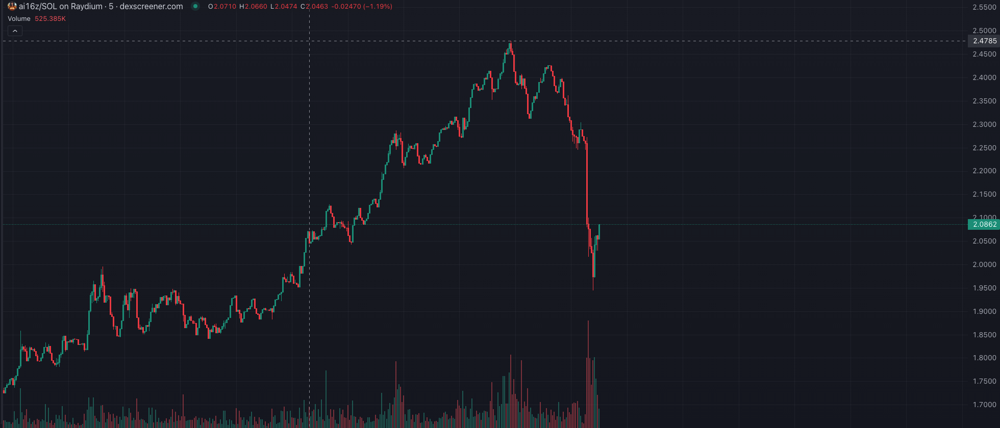
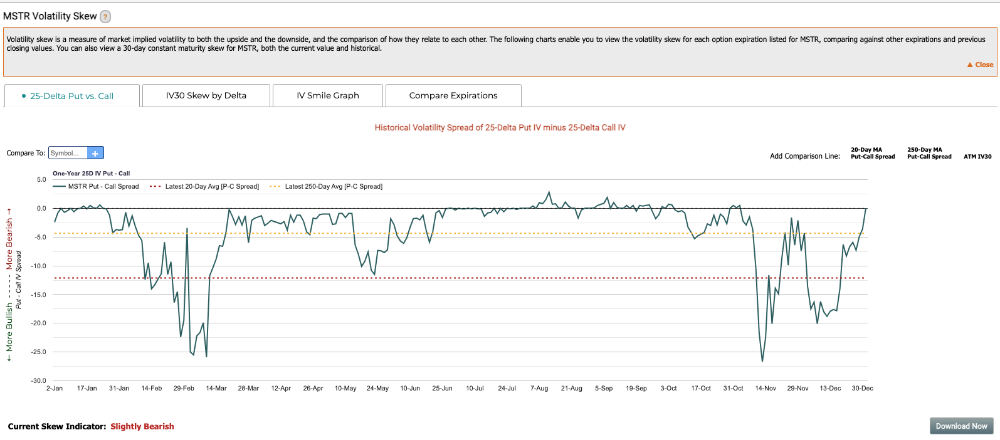

## WeekInEthNews 停更

[WeekInEthNews](https://x.com/evan_van_ness/status/1874625630836326418) 是一个跟名字一样，每周的 ETH 消息汇总，特别熟在开发方面的内容。

难得的事情是，这个项目是从 2016 年就开始了，到目前为止已经运行了八年时间，我大概看了一下，似乎是从来没有断更。此前以太坊基金会有在资助这个项目，但是后面更多的是象征意义的资助，也就是不实际给多少钱。

但是似乎是从 2024 年年底开始，以太坊基金会决定即使是象征意义的资助也要停止了，这促使了这个项目决定最终终止运行。从创始人的发的推特上来看，其实是表达出了对基金会巨大的失望和不满，他能搞到钱继续搞，但是不想搞了。

## 比特币价格预期

市场目前对于一月份，甚至二月份的比特币价格都处于比较乐观的态度。2025 年三月份的 Call 120k，130k 的期权价格下跌也反映出了市场的乐观态度。（大家预期一致，波动率降低）

普遍乐观的预期来自于当选总统特朗普上任后对 Crypto 领域的友好政策预期，以及 SEC 的领导层换人。

## Crypto ETF 2024 总结

- 2024 年 ETF 流入超过 1 万亿美元，表现超过了 4000 支 ETF
- IBIT 的净流入第三名，仅次于 Vanguard SP500 ETF 和 iShares Core SP500 ETF
- IBIT 的 AUM 超过 500 亿，超过了黄金的三百多亿
- FBTC 目前是富达最大的 ETF
- 2025 年 VanEck，21Shares 等都申请了 SOL，XRP，LTC，HBAR 等 ETF，除了这些还会有很多奇奇怪怪的 ETF

## Binance 上线三个 AI 币的合约

这次和其他的合约上币有所不同，之前合约上币通知一出来之后，不涨反跌，而且跌跌很厉害。特别是 ai16z，跌幅应该是最大的。

不过，先相信，会反弹回去的。

## 其他
- 美国国税局对 Crypto 投资税收规则的规定可能会影响投资者的行为与热情。现在要求投资者按照 FIFO 的方式来缴纳资本利得税。FIFO 就是你卖出去的币，默认是你最早买的那些币。这样在上涨的趋势中，你的资本利得默认是最多的。

- 瑞士 2B4CH 机构提出建议修改联邦宪法，增加比特币作为联邦银行的储备资产。2B4CH 是一个非营利性机构，创始人中有一个是 Tether 能源与挖矿部门的副主席。

- MicroStrategy 股票的 Bullish Skew 已经逐渐归零，意味着市场对这个股票的看涨情绪消失。主要是这个公司通过购买比特币来支撑自己股票上涨的预期消失。

