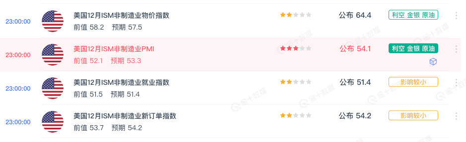
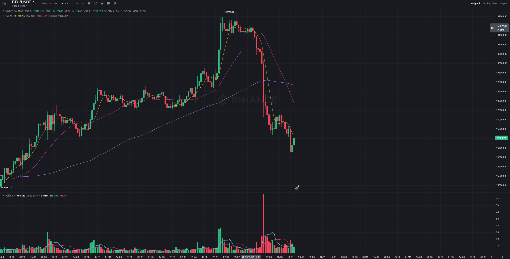
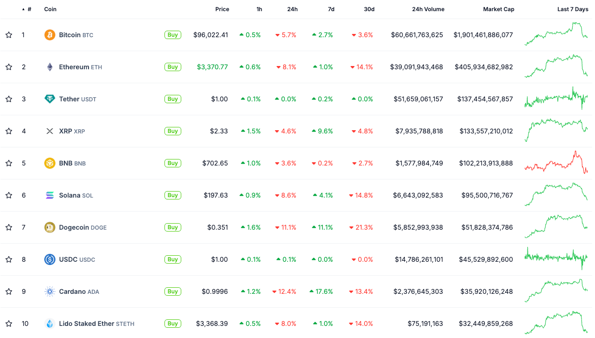
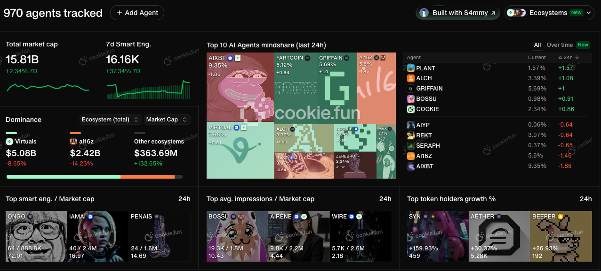
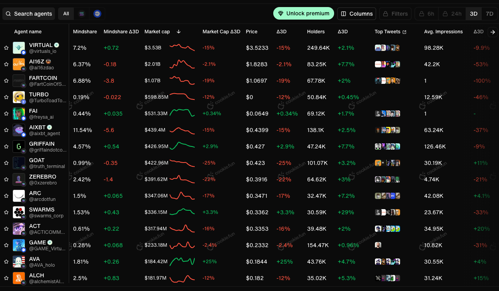

## 经济数据引发降低降息预期，资产普跌

昨天晚上美国经济数据和当选总统特朗普的牛逼发言是促使 Crypto 市场大跌的原因。当然，主要还是因为经济数据，直接导致了降息的预期降低。

昨天夜里公布了 ISM（供应链管理局, Insitute of supply management）非制造业物价指数，PMI 指数，就业指数和新订单指数都基本高于前值，特别是物价指数，预期 57.5，前值 58.2，实际数据 64.4. 由于美国的非制造行业（服务行业）的经济占比很重，所以这些数据实际表明的就是通胀的压力很大。

通胀的压力大自然而然就势必会影响美联储的货币政策，也就是不会降息了。因为美联储的两个核心目标，稳定物价和充分就业，稳定物价还是更重要的一个。市场自然而然对数据有了非常明显的反应：

- 降息预期降低
- 股票跌/币跌
- 长期国债收益率上涨
- 10y 和 2y spread 扩大

美国十年国债和两年国债的 Spread 正在逐渐扩大，已经达到了两年以来的最高水平。

股票市场也是一样全在跌，英伟达新高之后直接跳水大跌，其他的科技股基本表现类似。恐慌指数大涨。

比特币更是在昨天下午六点的时候就开始不对劲，这么多天好不容易涨上来重回十万甚至到了 102k，直接一波重创超过 5%。

其他的山寨币也是类似，以太坊在这么多人的注视下辛辛苦苦好不容易爬到了 3700 上下，以为可以稳住冲一冲 4000，直接一波干回了 3300.

这样的以太坊，谁能不爱？

XRP 和 BNB 下跌程度在 Top10 coins 里面相对较小。XRP 可能主要还是归功于在韩国的火热，而 BNB 除了 BN 的控制以外，也正好赶上了上新币的活动。其他的币种，Sol 和 Doge 下跌特别明显，特别是 Doge 在差不多回到 0.4 之后，下跌超过 10%。SOL 表现稍微比 Doge 好一些。

在合约交易方面，市场总持仓相比于昨天大概下降了 100 多亿美元，现在处于 1330 亿美元左右。

过去 24 小时爆仓差不多 7 亿美元，当然，绝大部分都是多单爆仓。

## AI

在说回 AI，头部的 AI agents 币种普遍表现比较差。今日 AI agents 的 token market 为 15.8B，相比于两三天前降低了差不多 2B 左右。但是从更长的时间来看还是有所上涨。

其中头部项目，VIRTUAL 下跌比较严重，目前市值只有大概 3.5B 左右，ai16z 表现也比较一般，币价伴随着昨天的下跌，从 2.4 又回到了前两天的 1.8 左右的水平，市值也只有 2B 左右。

其他的表现基本大差不差。

SWARM 在 BN 上线合约之后，和 ai16z 上线之后两天的表现一样，直接上线就是顶点卖出信号，从最高 5 个多亿的市值回到了现在 3 个多亿左右。

另外一个表现强劲的是 BUZZ，市值已经在刚刚成功突破了 1 个亿。

至于新项目，这里就不推荐了，我自己看 AI 项目也是一知半解，不懂技术。只能说现在还是注意力和大资金驱动的市场，还是一个 PVP 的游戏。

买涨不买跌，买新不买旧，买大不买小。

当然，极致的风险偏好用户除外，我也是买过 50 万市值的 BAN 的人。但是买过的 50 万市值小几百万市值的项目很多，几乎都是归零。