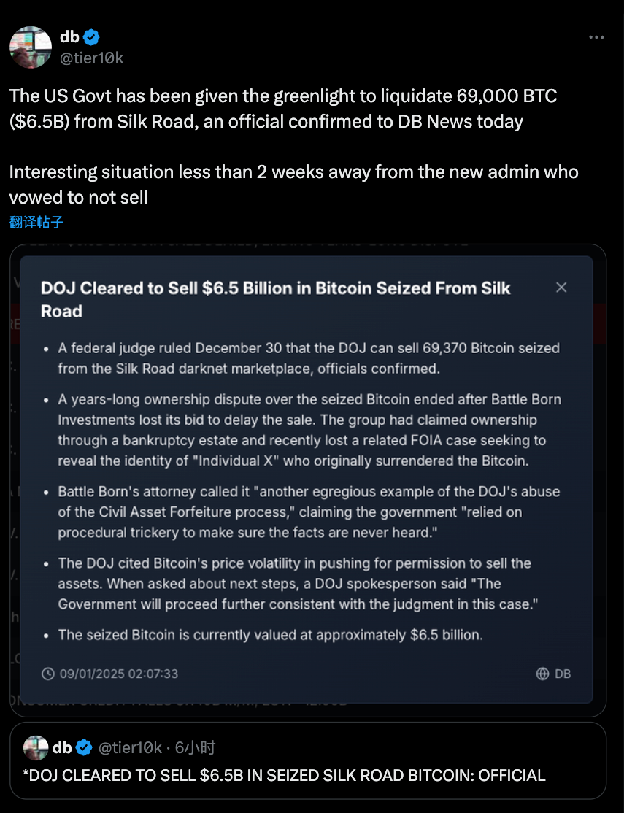

## 二次暴击！

在经历昨天的优秀经济数据带来的降息预期降低，从而导致的市场下跌以来，今天市场又迎来了沉痛的一击！当市场不好的时候，不好的消息会变的更多。相反市场好的时候，不好的消息也会被解读成好的消息。

比特币价格昨天凌晨继续跌破十万以后，今天再次下跌，目前已经差不多到了九万二。以太坊更是不争气，直接跌破三千。其他的山寨也是死的死伤的伤，

10Y 国债利率比昨天稍稍有些下降，目前 4.675%，和 2Y 的 Spread 基本不变。

昨天说市场持仓量下降了一百多亿，到了 1330 亿左右，今天继续下降了大概 40 亿，目前 1296 多亿。

- BNB 700，24h -0.3%
- SOL 192，24h -2.7%
- Doge 0.33，24h -2.6%

ETF 昨日：
- BTC 净流出 5.8 亿美元（历史第二大净流出）
- ETH 净流出 1.59 亿美元，已经是连续两天流出

## CFTC 主席最后一次讲话，强调 Crypto 的监管不足

https://www.cftc.gov/PressRoom/SpeechesTestimony/opabehnam49

CFTC 主席 Rostin Behnam 最后一次公开正式讲话。

> 总体而言，数字资产市场仍在继续融入传统金融机构，而没有全面的监管护栏。在缺乏联邦立法的情况下，人们对客户保护、欺诈和市场滥用行为的增加、更广泛的市场弹性甚至金融稳定性的担忧正在加剧。我们在历史上曾见过这种情况，我们将大量金融领域置于监督和责任之外，而且我们一次又一次地看到，最终结局很糟糕。

总结来讲就是觉得对 Crypto 的监管还是不足，而且监管法案的发展速度会比较慢。于此同时，Crypto 还在不断的进入传统资产的范畴，所以留给立法/执法机构的挑战很大。

SEC 即将离任的主席也发表了基本上类似的观点，当然他的观点一致都是如此。

实话实讲，这俩人说的都没错。

## 美国司法部批准出售此前没收的接近 7 万个 BTC

跟之前德国政府出售大量的比特币类似，给本来就受到昨天经济数据影响的市场又一沉痛一击！

## Bitfinex Alpha

- 矿工卖币的意愿减弱
- 宏观经济不确定，短期经济数据向好，降息减少对短期的涨势打击很大

## AI：惨不忍睹

- 总市值目前大概 140 亿，距离最高点跌了接近 50 亿美元
- 头部的也是继续下探底线。

## 其他

- Backpack 前两天收购 FTX EU，然后答应给之前的用户赔付的事情是自己瞎说的。FTX 今天发了新闻，说的很清楚：
  - Backpack 收购 FTX EU 的事情没有被美国破产法院批准。实际上发生的事情是 FTX EU 被卖给了 FTX Europe 的一些内部人士，然后这些内部人士又把这玩意卖给了 Backpack，所以不是说法院批准了这个事情。
  - Backpack 完全没有参与给债权人还钱的任何事情

- Do Kwon, 就是 Terra/UST 的创始人审判的时间暂时定在了明年的一月份，原因是因为太多资料要处理（报道说 6 个 G），之前 Do Kwon 不认罪，现在被关押在美国（在被引渡到美国之前他在黑山被关了 22 个月）。对了，之前 SBF 也是在这家法院接受审判。
  - > “朋友，没想到我们在这里碰面了”
