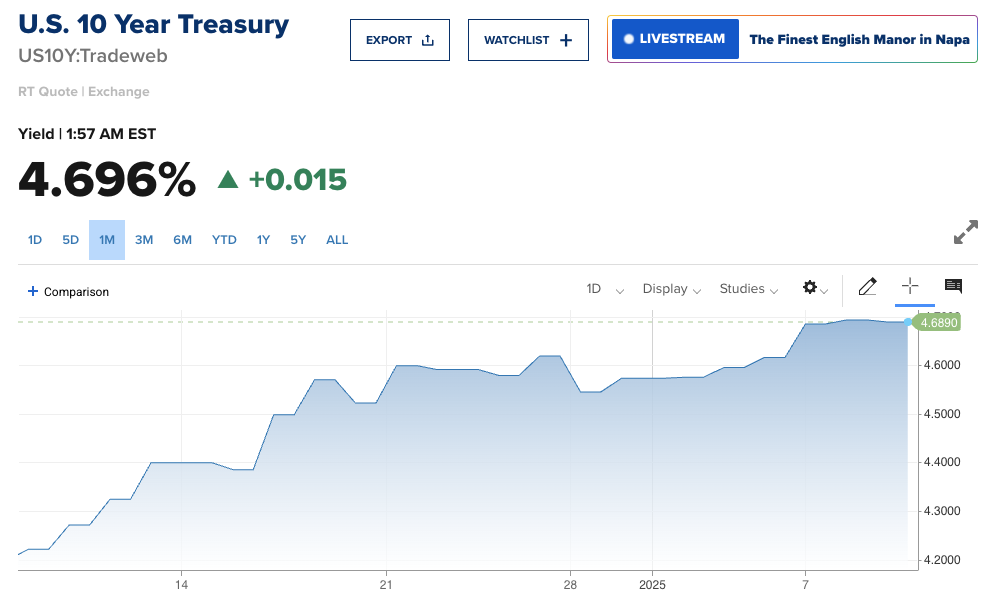
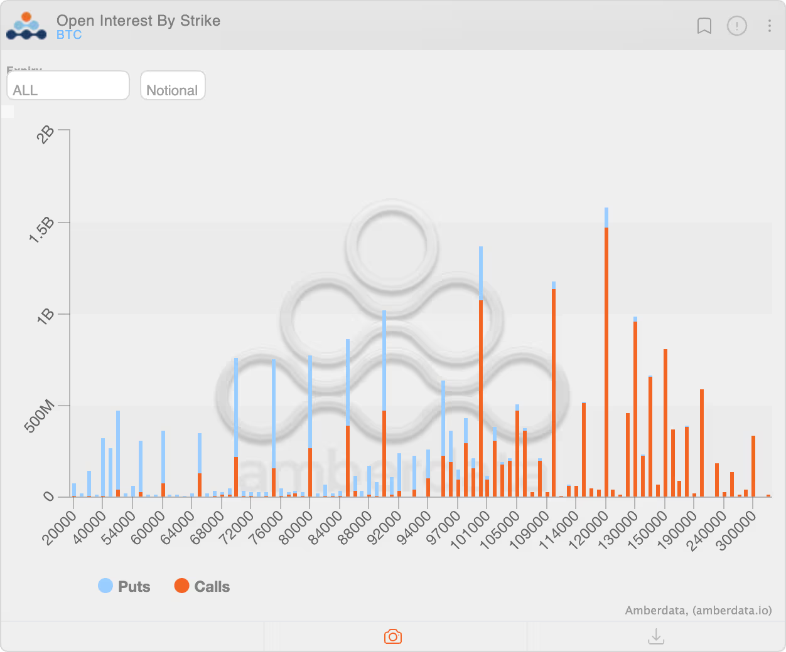
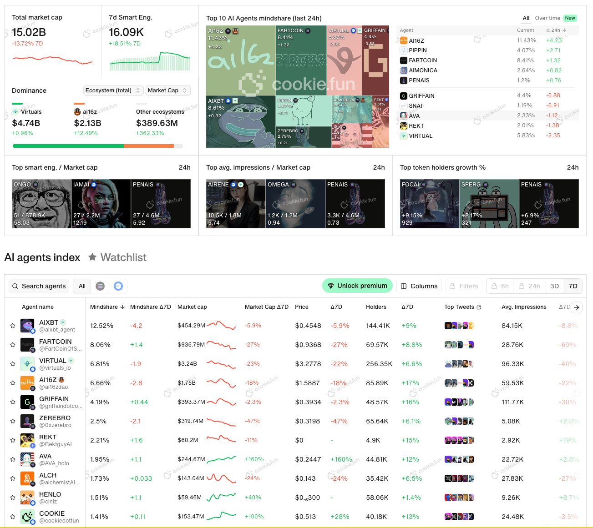

## 宏观经济差

比特币价格在今天凌晨下探到了 91k，去年 12 月月初下探 90k 以来的最低水平。

今天晚上即将公布的美国 12 月失业率数据至关重要。利率/股价/ Crypto 价格在这个敏感时期都会受到这个影响。

> 这里简单补充一下，之前说过美联储的两大目标，一个是充分就业一个是稳定利率。但是并不是说失业率越低就越好。在当前的市场环境里面，越是失业率越低，降息的可能性就越小。因为短期来看（长期可能不成立），失业率越低说劳动力市场越好，则工资可能就需要越高消费越好，反而会让通胀持续上升。
>
> 高通胀 + 低失业率也就是 2020 年疫情之后的美国经济异常组合。所以如果这次的数据失业率能够有所上升说明，说明美联储需要考虑降低利率来刺激经济。

以上都只是非常简单直白的解释，为了大概明白今天晚上公布的经济数据对价格的影响。所以我们希望看到的是失业率比之前的数值有所上升。但是目前市场预期应该和之前的水平差不多，而且结合前几天的发布的就业人数报告来看，失业率不太可能上升。所以对币价的预期可能不太好。

当然，Crypto 市场都是提前反应的，所以这两天的下跌可能已经是 Price in 了还没有发布的失业率数据。

为了纪念美国总统卡特，周三（1 月 9 号），股票交易都暂时停止。介于 BTC 现在和科技股，甚至可以说是（垃圾）科技股（不是说 BTC 是垃圾啊，别误会）走势一致，所以美国开市之后，如果区块链相关的股票下跌，可能会继续引起比特币价格破九万。

股市不开门所以 ETF 没有变化。

山寨币方面，ETH 还是继续不争气直接跌破了三千二，现在回到不到三千三的水平。SOL 最近表现一直不太好，七天跌了 9%。整天大部分的币种都试探了上个月 5 号的地点。

合约持仓方面相比于昨天有所下降但是不多。

## 期权市场依旧还是乐观

除了经济数据影响了对降息的预期，同时利率的强势上涨给所有风险资产强势一击以外，特朗普上台之后能否兑现承诺也是未知数。

而市场对于特朗普可能无法兑现承诺，只是为了获得选票的行为也有了一定的预期。如果当选之后关于 Crypto 的政策没有兑现或者支持，Crypto 从当选之后的涨幅可能会继续回吐，当然有人已经开始出售。

在期权市场方面，整体和前几天说的一样，看涨期权还是很多很乐观的，基本集中于 10 万 到 15 万之间。

## AI

Aiccelerate 成立，官方说自己是支持去中心化的 AI 发展的一个 DAO 组织。发起人包括 Shaw，Virtuals 的贡献者，还有 Story 的联合创始人等等，阵容还是比较强大的。

目前这个项目在 DAO FUN 上募资，募资的时候市值是 1.7M，但是参与是需要白名单的，所以不是所有用户都能够参与。目前参与的人数也就一百多个人。

这种阵容的市值起码应该是能够上亿。

具体的表现方面，市值和昨天相比有一些回升，总体市值从昨天的 14b 回到了现在的 15b，但是总体还是处于低位。

具体项目方面

- VIRTUAL 市值目前 3.2b
- ai16z 市值目前 1.57b
- aixbt 市值目前 447m
- GRIFFAIN 市值目前 393m
- SWARMS 市值目前 353m

还是那个逻辑，一旦这种大跌出现的时候，纯粹的 MEME 跌的会很厉害，但是但凡有了市场认知，有了市场预期的项目，项目又会很快起来，所以这里面的机会还是很大。

## 其他

- 网传  Coinbase 收到了来自 CFTC 的传票，要求 Coinbase 可能需要提供与 Polymarket（预测市场）有关的用户的信息，Coinbase 发了邮件警告/通知了用户。

- Alliance DAO 联创 Qiao Wang：All in ai agent 和 btc。

- Arbitrum 正式和 ai16z 合作，上线 ElizaOS

- 今天期权交割，很遗憾大部分的 Call 价格都是高于当前的价格