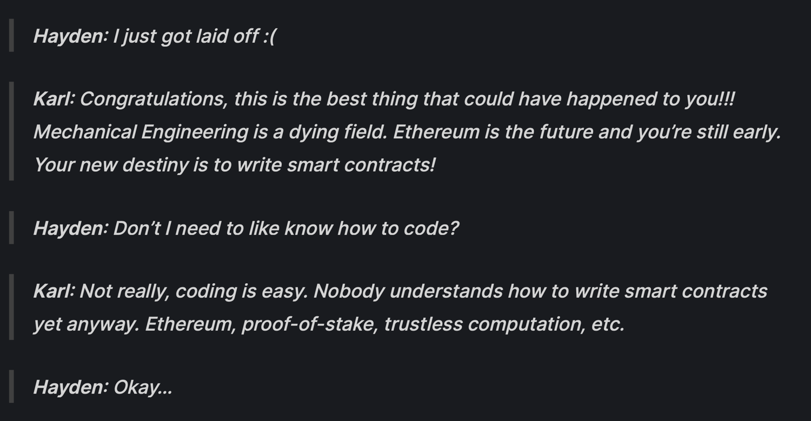

# DeFi 的历史回顾

DeFi，Decentralized Finance 指的是去中心化金融。这个概念由它相反的概念：中心化金融衍生而来。一般情况下，中心化金融指在传统的金融服务行业中，用户都是通过中心化的金融中介来获取服务。而 DeFi 的概念刚好相反，指当用户获取金融服务时，不再依赖于中心化的金融中介机构。

DeFi 最早可以追溯到比特币发明时的 2008 年，比特币最初出现时被定义为一种去中心化的，P2P 的现金形式。也就是说用户在使用比特币的时候，不再需要任何中心化的机构辅助，而是直接与其他用户进行交互。

而真正将 DeFi 这个概念发扬光大的是在以太坊诞生以后。其原因也很简单，比特币只能支持最简单的转账功能。而金融系统中常见的借贷，保险，交易功能均无法仅仅通过去中心化的比特币网络实现。以太坊的诞生和智能合约的加持使得这些复杂的金融功能有了实现的可能。


## DeFi 发展的简易时间线

- 2013 年，程序员 Vitalik Buterin 基于比特币产生了以太坊的想法。
- 2014 年，以太坊在其他几位联合创始人的努力下开始了正式开发以及众筹。
- 2015 年 7 月 30 日，以太坊作为第一个支持智能合约的去中心化公链平台正式发布。
- 2015 年，丹麦创业家 Rune Christensen 在 reddit 论坛上提出了 MakerDAO 和 DAI 的概念，叫做 eDollar。以太坊上第一次开始出现去中心化稳定币的概念。
- 2016 年，以太坊上的第一个去中心化交易所 OasisDEX 正式上线。 OasisDEX 还是一个以订单簿为基础的 DEX。现如今 Oasis 的主要产品已经不再是 DEX，而是一个 DAI 的借贷市场。
- 2017 年 Bancor 上线。Bancor 是第一批（也有人说是第一个）以 AMM（Auto Market Maker，自动化做市商）搭建的去中心化交易所。Bancor 的概念创立于 - 2016 年，但是直到 2017 年 2 月才正式发布了白皮书，随后几个月项目正式上线。此外，Bancor 的上线也伴随着众筹融资，一共融资了 1.53 亿美元也是当时最大的一个。
- 2017 年底，MakerDAO 的合约第一次激活上线以太坊，$ETH 作为开始唯一的抵押品。
- 2018 年 11 月，Uniswap 正式被发布并上线以太坊。Uniswap 的创始人是 Hayden Adams。有趣的是 Hayden Adams 在开发 Uniswap 之前是西门子公司的一个机械工程师，但是他在 17 年 6 月被辞退了。随后在以太坊基金会工作的朋友 Karl Floersch 的推荐之下开始研究智能合约，并开始准备做 Uniswap。




## Create your first Markdown Page

Create a file at `src/pages/my-markdown-page.md`:

```mdx title="src/pages/my-markdown-page.md"
# My Markdown page

This is a Markdown page
```

A new page is now available at [http://localhost:3000/my-markdown-page](http://localhost:3000/my-markdown-page).
