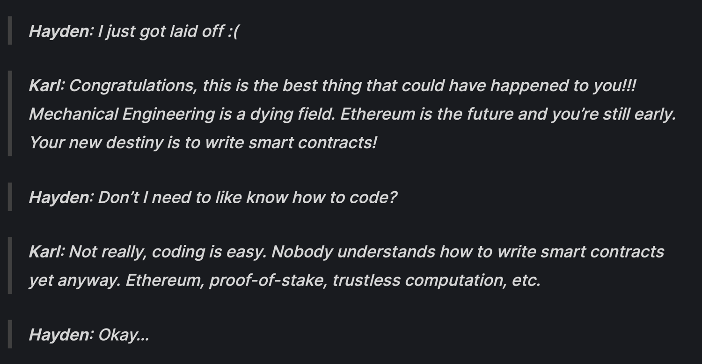

# DeFi 的历史回顾

DeFi，Decentralized Finance 指的是去中心化金融。这个概念由它相反的概念：中心化金融衍生而来。一般情况下，中心化金融指在传统的金融服务行业中，用户都是通过中心化的金融中介来获取服务。而 DeFi 的概念刚好相反，指当用户获取金融服务时，不再依赖于中心化的金融中介机构。

DeFi 最早可以追溯到比特币发明时的 2008 年，比特币最初出现时被定义为一种去中心化的，P2P 的现金形式。也就是说用户在使用比特币的时候，不再需要任何中心化的机构辅助，而是直接与其他用户进行交互。

而真正将 DeFi 这个概念发扬光大的是在以太坊诞生以后。其原因也很简单，比特币只能支持最简单的转账功能。而金融系统中常见的借贷，保险，交易功能均无法仅仅通过去中心化的比特币网络实现。以太坊的诞生和智能合约的加持使得这些复杂的金融功能有了实现的可能。

## DeFi 发展的简易时间线

- 2013 年，程序员 Vitalik Buterin 基于比特币产生了以太坊的想法。
- 2014 年，以太坊在其他几位联合创始人的努力下开始了正式开发以及众筹。
- 2015 年 7 月 30 日，以太坊作为第一个支持智能合约的去中心化公链平台正式发布。
- 2015 年，丹麦创业家 Rune Christensen 在 reddit 论坛上提出了 MakerDAO 和 DAI 的概念，叫做 eDollar。以太坊上第一次开始出现去中心化稳定币的概念。
- 2016 年，以太坊上的第一个去中心化交易所 OasisDEX 正式上线。 OasisDEX 还是一个以订单簿为基础的 DEX。现如今 Oasis 的主要产品已经不再是 DEX，而是一个 DAI 的借贷市场。
- 2017 年 Bancor 上线。Bancor 是第一批（也有人说是第一个）以 AMM（Auto Market Maker，自动化做市商）搭建的去中心化交易所。Bancor 的概念创立于 - 2016 年，但是直到 2017 年 2 月才正式发布了白皮书，随后几个月项目正式上线。此外，Bancor 的上线也伴随着众筹融资，一共融资了 1.53 亿美元也是当时最大的一个。
- 2017 年底，MakerDAO 的合约第一次激活上线以太坊，$ETH 作为开始唯一的抵押品。
- 2018 年 11 月，Uniswap 正式被发布并上线以太坊。Uniswap 的创始人是 Hayden Adams。有趣的是 Hayden Adams 在开发 Uniswap 之前是西门子公司的一个机械工程师，但是他在 17 年 6 月被辞退了。随后在以太坊基金会工作的朋友 Karl Floersch 的推荐之下开始研究智能合约，并开始准备做 Uniswap。

- 2019 年著名的以太坊借贷协议 Compound Finance v2 正式上线。Compound 由 Robert Leshner 和 Geoffrey Hayes 在 2018 年提出和创立，在开发 Compound 之前，两者在美国的一家食品外卖公司 Postmate 工作。

- 2020 年 6 月 Compound 正式推出了 COMP Token，并且将 Compound 协议的治理权限转交给 DAO 组织，并且利用 COMP 币作为核心的治理代币。COMP Token 被推出时的主要目的其实是激励借贷双方使用 Compound 协议，这样的行为在当时受到了极大的欢迎，大量用户为了获得 COMP Token 使用协议。

- 2020 年 7 月， Yearn Finance 正式发布。Yearn Finance 的创始人是 Andre Cronje，Yearn 受到极大关注的原因除了赶上 DeFi Summer，并且作为第一个 DeFi 收益聚合器以外，更为重要的是 Yearn 完全是社区项目公平发布。Andre Cronje 没有对项目进行任何的融资，并且他个人也没有预留任何的 YFI 代币。

- 2020 年 9 月 SushiSwap 由匿名开发者 ChefNomi 正式发布，并且对 Uniswap 发动了“吸血鬼攻击”。在那段日子里，每天都有大量的 DeFi 项目上线，SushiSwap 受到极大关注的原因就在于“吸血鬼攻击”。所谓“吸血鬼攻击”是指，SushiSwap 奖励为自己提供流动性的用户 SUSHI Token，而在那时 Uniswap 还没有发行 Token，也就是说提供流动性的用户没有任何额外奖励。通过额外的 SUSHI Token 奖励，SushiSwap 迅速获得了大量流动性，并且一度超越所有的同类 DEX。而为了应对 SushiSwap 的攻击，Uniswap 也不得不在当年九月中旬发行了自己的 Token UNI，并且也开始提供流动性激励奖励。

- 2021 年市场迎来了大牛市，以太坊上协议的发展和用户的增多也促使着以太坊使用成本低增加，也就是 Gas Fee 的上升，在牛市期间以太坊的 Gas Fee 基本都处于 100 以上。而昂贵的以太坊也促使着新的竞争对手出现，用户需要一条能够用得起的公链。BSC，币安智能链应运而生。伴随着币安交易所的加持，BSC 发展迅速，以太坊上大量的项目也近乎于复制的方式在 BSC 上建立起来，凭借着更加中心化带来的交易成本优势，BSC 发展迅速。作为平台的 Gas 币，BNB 也水涨船高，从几十美元最高上涨超过 600 美元。

- 2022 年，市场受到 LUNA / UST 以及 FTX 的影响，整体一直处于下行趋势。即使如此，Layer 2 也发展迅速。Layer 2 很早之前就开始出现，也是在以太坊的高 Gas 费用和较慢的处理速度的背景下出现。只不过 Layer 2 上的生态项目大量出现开始于 2022 年。

- 2022 年 9 月 5 日，以太坊的共识层正式从工作量证明（Proof of Work）转成了权益证明（Proof of Stake）。这个过程也被称作是 ‘合并，the Merge’。这一点为未来以太坊的升级和扩容打下了良好的基础。更重要的是，共识机制的改变使得以太坊的新增发量大大减少。在高 Gas Fee 的情况下甚至会让以太坊成为通缩的加密货币。

- 2023 年，我们迎来了 Layer2 的正式爆发，Optimism 早在 2022 年就发行了 OP Token，而另外一位强有力的竞争对手 Arbitrum 则是在 2023 年 3 月份才正式发行了 ARB Token。Arbitrum 是目前最大的 Layer 2 生态，拥有如 GMX，MAGIC 等明星项目。

DeFi 的发展经历了许多重大的事件，上述简易的时间线并不能覆盖 DeFi 领域的完整发展脉络。比如除了上述提及的以太坊和 BSC 之外，还有很多 Alt L1，也就是和 BSC 类似背景下出现的公链也在牛市期间发展迅速。

Solana 凭借着与以太坊不同的架构，能够实现更快速和便宜的交易处理速度。同时再加上 FTX 交易所的扶持，和一些明星项目的上线，也在牛市期间获得了大量的用户，而平台币 SOL 也从几美元的价格迅速飙升超过 200 美元。

Avalanche 的发展也是当时著名的 Layer 1 之一，同样是提供更加快速的交易处理速度实现了更加友好的用户体验。除此之外还有 Polygon，Tron 以及 Polkadot 的 Parachain 等。